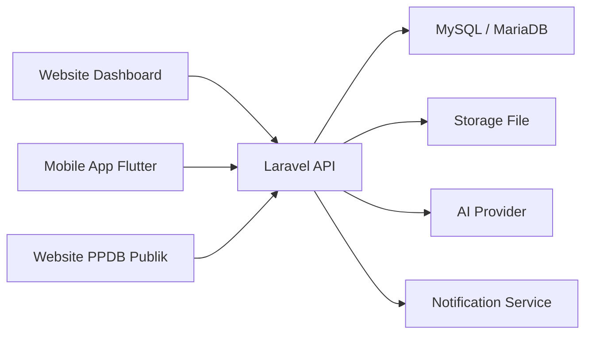
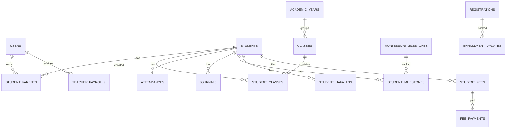

# PRD - Madani Nidham

**Produk:** Madani Nidham
**Jenis:** Sistem Informasi Akademik, Operasional, Keuangan, dan Komunikasi Sekolah
**Platform:** Website Dashboard, API Backend, Mobile App Flutter
**Target Institusi:** TKIT Madani Montessori Islamic School
**Versi PRD:** Revisi domain sekolah
**Catatan:** Dokumen ini disusun khusus untuk Madani Nidham. Struktur modul mengikuti fitur sekolah yang ada di codebase, bukan template sistem dari domain lain.

---

# 1. Ringkasan Produk

Madani Nidham adalah platform terpadu untuk mengelola operasional sekolah dari pendaftaran murid baru sampai pemantauan perkembangan anak, komunikasi orang tua, raport, keuangan, dan dukungan AI berbasis data sistem.

Website dashboard dipakai oleh super admin, kepala sekolah, admin, dan guru. Mobile app Flutter dipakai oleh orang tua dan guru agar aktivitas harian dapat dilihat dan dicatat dari ponsel.

Tujuan utama produk:

1. Menyatukan data akademik, PPDB, komunikasi, dan keuangan sekolah.
2. Memudahkan guru mencatat aktivitas anak setiap hari.
3. Memudahkan admin mengelola data murid, user, pembayaran, dan pengaturan.
4. Memudahkan kepala sekolah membaca kondisi sekolah lewat dashboard dan laporan.
5. Memudahkan orang tua memantau perkembangan anak dari mobile app.
6. Membuat AI internal menjawab hanya dari data yang tersimpan di sistem.

---

# 2. Masalah yang Diselesaikan

Sebelum sistem terpadu, operasional sekolah rentan mengalami:

* data murid tersebar di chat, spreadsheet, dan dokumen manual,
* absensi, jurnal, Montessori, hafalan, portofolio, dan galeri tidak konsisten,
* orang tua sulit melihat perkembangan anak secara runtut,
* PPDB tidak terhubung langsung dengan data murid aktif,
* SPP, uang pendaftaran, kas manual, dan gaji guru tidak terbaca dalam satu pusat keuangan,
* audit uang masuk dan keluar sulit ditelusuri,
* AI rawan mengarang bila tidak diberi konteks data yang kuat,
* pengaturan website, dokumen PPDB, tahun ajaran, dan tanda tangan raport tersebar.

Madani Nidham menyelesaikan masalah ini dengan satu alur:

**PPDB -> review admin -> konversi murid -> kelas aktif -> absensi dan perkembangan -> komunikasi orang tua -> raport -> pembayaran -> pusat keuangan -> audit -> AI berbasis data.**

---

# 3. Sasaran Produk

## 3.1 Sasaran Website Dashboard

Website dashboard harus menjadi pusat kerja harian internal sekolah:

* admin mengelola data dan pengaturan,
* guru mencatat kegiatan anak,
* kepala sekolah memantau progres dan keuangan,
* data dapat dicari, difilter, diedit, dan diaudit.

## 3.2 Sasaran Mobile App Flutter

Mobile app harus memudahkan akses cepat:

* orang tua melihat data anak,
* orang tua mengirim izin atau sakit,
* orang tua melihat tagihan, bukti bayar, pengumuman, agenda, galeri, dan raport,
* guru bisa mengisi data harian dari ponsel,
* notifikasi penting masuk langsung ke perangkat.

## 3.3 Sasaran Backend API

Backend API harus:

* menjadi sumber data tunggal untuk web dan mobile,
* mengatur auth, role, permission, validasi, upload, dan response standar,
* menyimpan audit perubahan data penting,
* menyediakan endpoint khusus untuk dashboard, keuangan, PPDB, AI, dan mobile.

---

# 4. Platform Produk

## 4.1 Website Dashboard

Teknologi saat ini:

* Next.js App Router,
* Tailwind CSS,
* TanStack Query,
* Recharts,
* modular page components.

Kegunaan:

* dashboard sekolah,
* CRUD data akademik,
* PPDB,
* pusat keuangan,
* pengaturan,
* riwayat AI,
* laporan dan export.

## 4.2 Backend API

Teknologi saat ini:

* Laravel API,
* Laravel Sanctum,
* Spatie Permission,
* MySQL/MariaDB,
* DomPDF,
* service layer untuk AI, fee, digest, dan finance.

Kegunaan:

* autentikasi,
* role-based access control,
* validasi data,
* database relational,
* upload file,
* agregasi dashboard,
* integrasi AI provider.

## 4.3 Mobile App Flutter

Mobile app Flutter dirancang memakai API yang sama dengan website.

Kegunaan:

* akses orang tua,
* akses guru,
* push notification,
* tampilan ringkas per anak,
* form cepat untuk izin, jurnal, hafalan, Montessori, portofolio, dan galeri sesuai role.

---

# 5. Role Pengguna

## 5.1 Super Admin

Super admin memiliki akses penuh ke seluruh modul.

Kebutuhan:

* mengelola user, role, dan permission,
* mengelola pengaturan sekolah dan website,
* melihat semua dashboard,
* mengelola data akademik,
* mengelola keuangan,
* melihat dan membersihkan riwayat AI,
* melakukan koreksi data lintas modul.

## 5.2 Kepala Sekolah

Kepala sekolah fokus pada pemantauan dan validasi.

Kebutuhan:

* melihat dashboard utama,
* melihat performa kelas dan guru,
* melihat absensi, jurnal, Montessori, hafalan, portofolio, dan galeri,
* melihat PPDB,
* melihat pusat keuangan,
* melihat laporan dan raport,
* memakai AI manajerial untuk membaca data sekolah.

## 5.3 Admin Sekolah

Admin sekolah menjalankan pekerjaan operasional.

Kebutuhan:

* mengelola murid, orang tua, kelas, dan tahun ajaran,
* mengelola PPDB,
* mengelola SPP, uang pendaftaran, rekening, dan kas manual,
* mengelola gaji guru,
* mengelola pengumuman, agenda, artikel parenting, dan pengaturan website,
* membantu koreksi data absensi dan jurnal bila dibutuhkan.

## 5.4 Guru

Guru mencatat aktivitas dan perkembangan anak.

Kebutuhan:

* melihat kelas dan daftar murid,
* mengisi absensi hari ini,
* menulis jurnal harian,
* mengisi progres Montessori,
* mengisi progres hafalan dan doa,
* mengunggah portofolio dan galeri,
* melihat agenda dan pengumuman,
* melihat jadwal dan booking bimbel bila aktif.

## 5.5 Orang Tua / Wali Murid

Orang tua memakai mobile app.

Kebutuhan:

* melihat data anak,
* melihat absensi,
* membaca jurnal, Montessori, hafalan, doa, portofolio, galeri, dan raport,
* mengirim permintaan izin atau sakit,
* melihat tagihan SPP dan status pembayaran,
* mengunggah bukti bayar bila diizinkan,
* membaca pengumuman, agenda, dan artikel parenting,
* memakai AI anak dengan batasan data anak sendiri.

## 5.6 Calon Orang Tua

Calon orang tua memakai halaman PPDB publik.

Kebutuhan:

* mengisi formulir pendaftaran,
* mengunggah dokumen,
* melihat nomor pendaftaran,
* mengecek status pendaftaran,
* menerima informasi tahap berikutnya.

---

# 6. Ruang Lingkup Produk

## 6.1 Termasuk dalam Website Dashboard

* Login dan profil user.
* Role dan permission.
* Dashboard ringkasan sekolah.
* Manajemen tahun ajaran.
* Manajemen kelas.
* Manajemen murid dan orang tua.
* Absensi dan rekap.
* Permintaan izin/sakit.
* Jurnal perkembangan.
* Montessori area dan milestone.
* Hafalan surah dan doa harian.
* Portofolio.
* Galeri.
* Raport PDF.
* Pengumuman.
* Agenda.
* Artikel parenting.
* PPDB.
* Uang pendaftaran.
* SPP.
* Rekening sekolah.
* Pusat Keuangan.
* Audit uang masuk dan keluar.
* Gaji guru.
* Bimbel.
* Notifikasi.
* AI chat dan riwayat pemakaian.
* Pengaturan sekolah dan website.

## 6.2 Termasuk dalam Mobile App Flutter

* Login.
* Profil pengguna.
* Dashboard ringkas.
* Pilihan anak untuk orang tua.
* Absensi anak.
* Jurnal anak.
* Montessori anak.
* Hafalan dan doa anak.
* Portofolio anak.
* Galeri kelas.
* Raport.
* Tagihan SPP.
* Upload bukti bayar.
* Izin/sakit.
* Pengumuman.
* Agenda.
* Artikel parenting.
* AI anak.
* Push notification.
* Form guru untuk input harian.

## 6.3 Tidak Termasuk untuk Versi Awal

* Payment gateway realtime.
* Virtual account bank otomatis.
* Akuntansi double-entry lengkap.
* Multi-cabang sekolah.
* Sinkronisasi offline penuh.
* Video learning.
* Chat realtime antar user.
* Integrasi WhatsApp Business resmi.
* Tanda tangan digital tersertifikasi production.
* Integrasi sistem pendidikan pemerintah otomatis.

---

# 7. Prinsip Produk

1. Data yang sama tidak boleh diinput berkali-kali tanpa kebutuhan jelas.
2. Semua data harian harus punya tanggal, pembuat, dan waktu terakhir diubah.
3. Input tanggal untuk absensi, jurnal, Montessori, hafalan, portofolio, dan galeri tidak boleh melewati hari ini.
4. Halaman utama menampilkan data hari ini, sedangkan halaman arsip menampilkan semua data dengan search dan filter.
5. Sidebar hanya berisi menu inti; submenu arsip atau audit dibuka dari menu inti masing-masing.
6. Pusat Keuangan harus membaca semua sumber uang yang relevan.
7. AI tidak boleh menjawab angka atau fakta tanpa dukungan data sistem.
8. Mobile app harus memakai API yang sama agar data konsisten.

---

# 8. Arsitektur Sistem



Komponen utama:

* Website dashboard untuk internal sekolah.
* Mobile app Flutter untuk orang tua dan guru.
* API backend sebagai pusat auth, validasi, dan data.
* Database sebagai sumber kebenaran.
* Storage untuk foto, bukti bayar, dokumen, dan PDF.
* AI provider sebagai lapisan jawaban, bukan sumber data utama.

---

# 9. Struktur Menu Website Dashboard

## 9.1 Utama

* Dashboard

## 9.2 Akademik

* Murid
* Absensi
* Jurnal
* Montessori
* Hafalan
* Portofolio
* Raport

## 9.3 Komunikasi

* Pengumuman
* Agenda
* Galeri
* Parenting

## 9.4 Pendaftaran

* PPDB

## 9.5 Program

* Bimbel

## 9.6 Keuangan

* Pusat Keuangan
* SPP
* Uang Pendaftaran
* Gaji Guru
* Pengaturan Keuangan

## 9.7 AI

* History Chat

## 9.8 Pengaturan

* Pengaturan sekolah
* Admin user
* Role admin
* Website
* Tahun ajaran
* Dokumen PPDB
* Tanda tangan raport

---

# 10. Kebutuhan Dashboard

Dashboard harus mengurangi ruang kosong dan menampilkan informasi yang membantu kerja harian.

Informasi prioritas:

* ringkasan murid aktif,
* absensi hari ini,
* progres akademik hari ini,
* action item yang butuh tindak lanjut,
* PPDB terbaru,
* status pembayaran,
* agenda terdekat,
* pengumuman terbaru,
* ringkasan pusat keuangan,
* aktivitas AI atau data yang perlu dicek.

Bagian bawah dashboard harus diisi panel berguna, misalnya:

* anak belum diabsen,
* jurnal yang belum lengkap,
* pembayaran perlu konfirmasi,
* PPDB yang belum ditindak,
* agenda 7 hari ke depan,
* update galeri/portofolio terbaru.

---

# 11. Modul Akademik

## 11.1 Murid

Fitur:

* tambah, edit, hapus murid,
* upload foto murid,
* relasi orang tua,
* relasi kelas dan tahun ajaran,
* status aktif,
* search dan filter.

Data minimal:

* NIS,
* nama lengkap,
* nama panggilan,
* tanggal lahir,
* jenis kelamin,
* alamat,
* foto,
* orang tua,
* kelas aktif.

## 11.2 Absensi

Fitur:

* catat absensi per kelas,
* status hadir, izin, sakit, alfa,
* catatan per anak,
* rekap harian dan mingguan,
* export,
* edit dan hapus sesuai permission.

Aturan:

* tanggal maksimal hari ini,
* satu murid hanya punya satu status absensi per tanggal,
* perubahan harus memperbarui `updated_at`.

## 11.3 Permintaan Izin/Sakit

Fitur:

* orang tua mengirim izin/sakit dari mobile,
* lampiran opsional,
* admin/guru review,
* status pending, approved, rejected,
* setelah approved dapat mempengaruhi absensi.

## 11.4 Jurnal

Halaman utama Jurnal menampilkan:

* keterangan `Hari ini, {tanggal}`,
* daftar jurnal hari ini,
* form tambah jurnal,
* filter kelas dan murid,
* tombol menuju arsip jurnal.

Subpage arsip Jurnal:

* menampilkan semua jurnal tanpa batasan hari,
* search nama murid, kelas, guru, dan isi jurnal,
* filter tanggal, kelas, murid, guru,
* edit, hapus, dan lihat detail,
* menampilkan terakhir diubah.

Aturan:

* tanggal jurnal maksimal hari ini,
* setiap perubahan memperbarui `updated_at`.

## 11.5 Montessori

Halaman utama Montessori menampilkan:

* keterangan `Hari ini, {tanggal}`,
* progres yang diperbarui hari ini,
* area Montessori,
* milestone per murid,
* tombol menuju arsip Montessori.

Subpage arsip Montessori:

* menampilkan semua progres Montessori,
* search nama murid, area, milestone, status,
* filter kelas, area, status, tanggal,
* edit progres,
* menampilkan terakhir diubah.

Aturan:

* tanggal pencatatan maksimal hari ini,
* progress harus tersimpan per murid dan milestone.

## 11.6 Hafalan dan Doa

Halaman utama Hafalan menampilkan:

* keterangan `Hari ini, {tanggal}`,
* progres hafalan hari ini,
* daftar surah dan doa,
* update status per murid,
* tombol menuju arsip hafalan.

Subpage arsip Hafalan:

* menampilkan semua progres hafalan dan doa,
* search nama murid, surah, doa, status,
* filter kelas, jenis, status, tanggal,
* edit progres,
* menampilkan terakhir diubah.

Aturan:

* tanggal pencatatan maksimal hari ini,
* perubahan harus tercatat di `updated_at`.

## 11.7 Portofolio

Fitur:

* tambah portofolio karya anak,
* upload gambar atau file,
* relasi murid, kelas, guru,
* tandai unggulan,
* search dan filter,
* edit dan hapus.

Aturan:

* tanggal portofolio maksimal hari ini.

## 11.8 Galeri

Fitur:

* tambah galeri kelas,
* upload foto kegiatan,
* status publish,
* search dan filter,
* edit dan hapus.

Aturan:

* tanggal galeri maksimal hari ini.

## 11.9 Raport

Fitur:

* draft raport per murid,
* narasi perkembangan,
* ringkasan Montessori dan hafalan,
* publish PDF,
* tanda tangan visual kepala sekolah,
* status signature.

Aturan:

* raport terkait tahun ajaran dan kelas,
* PDF yang sudah dipublish harus punya URL,
* perubahan draft harus terlihat dari `updated_at`.

---

# 12. Modul PPDB dan Uang Pendaftaran

## 12.1 PPDB Publik

Fitur untuk calon orang tua:

* isi formulir pendaftaran,
* upload dokumen,
* dapat nomor pendaftaran,
* cek status pendaftaran.

Data PPDB:

* nama anak,
* tanggal lahir,
* jenis kelamin,
* program yang dipilih,
* nama orang tua,
* kontak orang tua,
* email orang tua,
* alamat,
* dokumen,
* status.

## 12.2 Review PPDB

Fitur admin:

* melihat daftar pendaftaran,
* search dan filter status,
* update status,
* upload dokumen tambahan,
* konversi pendaftar menjadi murid.

Status:

* pending,
* reviewed,
* accepted,
* rejected,
* converted.

## 12.3 Uang Pendaftaran

Halaman harus memiliki judul jelas: **Uang Pendaftaran**.

Fitur:

* ringkasan uang pendaftaran,
* list pembayaran uang pendaftaran,
* search nama anak/orang tua/nomor pendaftaran,
* filter status dan tanggal,
* tambah atau edit update pembayaran,
* bukti pembayaran,
* integrasi ke Pusat Keuangan sebagai uang masuk.

---

# 13. Modul Pusat Keuangan

Pusat Keuangan menggantikan nama lama Total Keuangan di UI, route, label, dan terminologi backend.

## 13.1 Sumber Data Keuangan

Pusat Keuangan harus menggabungkan:

* pembayaran SPP terkonfirmasi,
* uang pendaftaran,
* kas masuk manual,
* kas keluar manual,
* gaji guru,
* koreksi transaksi yang dibuat admin.

Satu transaksi hanya boleh dihitung sekali.

## 13.2 Ringkasan Pusat Keuangan

Urutan ringkasan:

1. Saldo.
2. Uang Masuk.
3. Uang Keluar.
4. Transaksi perlu tindak lanjut bila ada.

Filter bulan yang sejajar dengan judul utama tidak diperlukan.

## 13.3 Grafik dan Chart

Grafik dan chart yang sudah ada harus dipertahankan.

Revisi yang dibutuhkan:

* bagian komposisi kas dibuat lebih compact,
* kesehatan kas bulan ini dibuat ringkas,
* tombol filter grafik dibuat seperti tab filter PPDB,
* grafik harian memakai titik jam per 1 jam,
* titik value tidak harus sejajar persis dengan label jam,
* jika transaksi jam 19:20 maka titik berada di antara 19:00 dan 20:00,
* grafik tetap membaca transaksi aktual dari database.

## 13.4 Audit Uang Masuk dan Keluar

Audit di bagian bawah Pusat Keuangan:

* tidak memakai card Masuk, Keluar, Net,
* menampilkan list transaksi uang masuk dan keluar,
* filter cepat: hari ini, 7 hari, 1 bulan, 3 bulan,
* search berdasarkan nama, kategori, sumber, deskripsi, nominal,
* sumber transaksi terlihat jelas,
* waktu transaksi dan terakhir diubah terlihat.

## 13.5 Submenu Audit Bulanan

Submenu audit bulanan diakses dari menu Pusat Keuangan, bukan sidebar.

Fitur:

* menampilkan audit satu bulan terakhir,
* tidak perlu filter periode,
* search tetap tersedia,
* data grouped per bulan atau tanggal,
* dapat membuka detail transaksi asal.

## 13.6 Kas Manual

Fitur:

* tambah kas masuk,
* tambah kas keluar,
* edit kas,
* hapus kas,
* kategori,
* deskripsi,
* tanggal dan waktu transaksi,
* bukti opsional.

Aturan:

* kas masuk menambah uang masuk,
* kas keluar menambah uang keluar,
* semuanya muncul di grafik, chart, dan audit.

---

# 14. Modul SPP

Fitur:

* daftar tagihan SPP,
* generate tagihan,
* detail tagihan per murid,
* upload bukti bayar,
* konfirmasi pembayaran,
* tolak pembayaran,
* aging tagihan,
* export,
* search.

Search harus bisa mencari:

* nama murid,
* NIS,
* kelas,
* jenis tagihan,
* status,
* periode.

Judul halaman SPP tidak boleh hilang.

---

# 15. Modul Gaji Guru

Fitur:

* daftar gaji guru,
* tambah gaji,
* edit gaji,
* hapus gaji,
* filter status,
* search nama guru,
* total payroll,
* integrasi ke Pusat Keuangan sebagai uang keluar.

Filter bulan yang sejajar dengan judul utama tidak diperlukan.

Judul halaman Gaji Guru tidak boleh hilang.

---

# 16. Modul Komunikasi

## 16.1 Pengumuman

Fitur:

* tambah pengumuman,
* draft dan publish,
* target semua orang tua, kelas tertentu, atau user tertentu,
* notifikasi ke penerima,
* search dan filter.

## 16.2 Agenda

Fitur:

* tambah agenda,
* tanggal mulai dan selesai,
* lokasi,
* target,
* tampil di dashboard dan mobile app.

## 16.3 Galeri

Fitur dijelaskan juga di modul akademik karena galeri adalah komunikasi visual ke orang tua.

## 16.4 Artikel Parenting

Fitur:

* tambah artikel,
* edit,
* publish,
* tampil di mobile app orang tua,
* search dan filter.

---

# 17. Modul Bimbel

Fitur:

* sesi bimbel,
* jadwal,
* booking,
* konfirmasi booking,
* cancel,
* complete,
* relasi guru dan murid,
* tampil di dashboard dan mobile.

Status:

* scheduled,
* booked,
* confirmed,
* completed,
* cancelled.

---

# 18. Modul Pengaturan

## 18.1 Pengaturan Sekolah

Pengaturan sekolah harus menjadi pusat konfigurasi utama.

Fitur:

* nama sekolah,
* logo,
* alamat,
* kontak,
* kepala sekolah,
* tanda tangan raport,
* rekening sekolah,
* dokumen PPDB,
* konfigurasi website.

## 18.2 Admin User dan Role

Sub menu Admin User dan Role Admin dipindahkan ke area yang sejajar dengan card Pengaturan Sekolah.

Tujuan:

* admin tidak perlu pindah halaman terlalu jauh,
* user dan role terasa bagian dari pengaturan sekolah,
* permission tetap jelas.

## 18.3 Pengaturan Website

Tombol Website harus membuka panel/dropdown berisi pengaturan website.

Isi minimal:

* tahun ajaran,
* dokumen PPDB,
* tanda tangan raport,
* logo website,
* banner PPDB,
* link sosial media,
* kontak sekolah,
* alamat dan peta,
* SEO title dan description,
* teks sambutan,
* status publish halaman PPDB,
* pengumuman website.

## 18.4 Tahun Ajaran

Tahun ajaran tidak hanya input nama manual.

Aturan:

* sistem membaca tanggal saat ini,
* jika masih sebelum tanggal mulai tahun ajaran baru, sistem tetap memakai tahun ajaran berjalan,
* contoh: Mei 2026 masih tahun ajaran 2025/2026,
* tahun ajaran baru mulai setelah tanggal konfigurasi dimulai,
* admin dapat mengatur tanggal mulai tahun ajaran baru,
* admin dapat mengatur tanggal akhir tahun ajaran,
* sistem dapat menandai tahun ajaran aktif berdasarkan tanggal tersebut.

Data:

* nama tahun ajaran,
* start_date,
* end_date,
* new_year_start_month,
* new_year_start_day,
* is_active.

---

# 19. Modul AI

AI di Madani Nidham bukan fitur chat bebas. AI harus menjawab dari data yang tersedia.

## 19.1 AI Orang Tua

Kebutuhan:

* menjawab pertanyaan tentang anak milik user tersebut,
* membaca absensi, jurnal, Montessori, hafalan, doa, portofolio, galeri, raport, tagihan, pengumuman, dan agenda,
* tidak boleh membaca data anak lain.

## 19.2 AI Manajerial

Kebutuhan:

* membantu kepala sekolah/admin membaca data sekolah,
* menjawab kondisi absensi, PPDB, keuangan, SPP, gaji, dan aktivitas akademik,
* dapat menampilkan angka ringkas berdasarkan query database.

## 19.3 Anti-Halusinasi

Aturan wajib:

* AI harus memakai konteks data sistem sebelum menjawab.
* Jika data tidak tersedia, AI harus bilang data belum tersedia.
* AI tidak boleh mengarang angka pemasukan, saldo, tunggakan, absensi, atau progres.
* AI harus membedakan uang masuk, uang keluar, dan saldo.
* AI harus menyebut periode data jika menjawab angka.
* AI harus menyebut sumber modul jika relevan.
* AI harus menghindari jawaban pasti jika data tidak lengkap.

## 19.4 Kuota dan Riwayat

Fitur:

* riwayat chat user,
* riwayat chat per anak,
* usage harian,
* token per menit,
* admin dapat melihat dan menghapus riwayat sesuai permission.

---

# 20. Mobile App Flutter

## 20.1 Prinsip Mobile

Mobile app harus cepat, ringkas, dan cocok dipakai orang tua maupun guru.

Prinsip:

* satu anak dapat dipilih dari home,
* data terbaru tampil dulu,
* notifikasi masuk ke halaman terkait,
* form guru harus singkat,
* status pembayaran mudah dibaca,
* data sensitif tidak tampil untuk user yang tidak berhak.

## 20.2 Menu Orang Tua

Menu:

* Beranda,
* Anak Saya,
* Absensi,
* Jurnal,
* Montessori,
* Hafalan dan Doa,
* Portofolio,
* Galeri,
* Raport,
* Tagihan,
* Izin/Sakit,
* Pengumuman,
* Agenda,
* Parenting,
* AI Anak,
* Profil.

## 20.3 Menu Guru

Menu:

* Beranda Guru,
* Kelas Saya,
* Absensi,
* Jurnal,
* Montessori,
* Hafalan,
* Portofolio,
* Galeri,
* Bimbel,
* Pengumuman,
* Agenda,
* Profil.

## 20.4 Fitur Mobile Prioritas

Prioritas tahap awal:

1. Login.
2. Profil.
3. Data anak.
4. Absensi.
5. Jurnal.
6. Montessori.
7. Hafalan.
8. Tagihan.
9. Pengumuman.
10. Agenda.
11. Notifikasi.

Tahap berikutnya:

1. Portofolio.
2. Galeri.
3. Raport PDF.
4. Upload bukti bayar.
5. Izin/sakit.
6. AI anak.
7. Form guru.

---

# 21. API dan Response

Backend API memakai prefix:

```txt
/api/v1
```

Format sukses:

```json
{
  "success": true,
  "message": "Data berhasil diambil",
  "data": {},
  "meta": {}
}
```

Format error:

```json
{
  "success": false,
  "message": "Pesan error",
  "errors": {}
}
```

Kebutuhan API:

* auth token memakai Sanctum,
* response konsisten,
* pagination untuk list besar,
* validasi request di backend,
* upload file memakai storage yang aman,
* endpoint web dan mobile berbagi data yang sama,
* permission dicek di backend, bukan hanya UI.

---

# 22. Data dan Database

Tabel utama:

* `users`
* `roles`
* `permissions`
* `academic_years`
* `classes`
* `students`
* `student_parents`
* `student_classes`
* `attendances`
* `absence_requests`
* `journals`
* `montessori_areas`
* `montessori_milestones`
* `student_milestones`
* `hafalan_surahs`
* `student_hafalans`
* `doa_dailies`
* `student_doas`
* `student_portfolios`
* `class_galleries`
* `reports`
* `announcements`
* `school_agendas`
* `parenting_articles`
* `registrations`
* `enrollment_updates`
* `school_bank_accounts`
* `fee_types`
* `student_fees`
* `fee_payments`
* `finance_entries`
* `teacher_payrolls`
* `tutoring_sessions`
* `tutoring_bookings`
* `school_notifications`
* `settings`
* `ai_chat_histories`
* `ai_manager_chat_histories`
* `ai_chat_usages`

Aturan data:

* tabel penting wajib punya `created_at` dan `updated_at`,
* halaman arsip harus menampilkan terakhir diubah,
* data keuangan harus punya sumber transaksi,
* data AI tidak boleh menjadi sumber angka utama,
* data murid harus bisa ditelusuri dari kelas dan orang tua.

---

# 23. Relasi Data Utama



Relasi penting:

* satu user orang tua dapat memiliki beberapa anak,
* satu murid dapat terkait ke beberapa kelas sepanjang tahun berbeda,
* satu kelas terkait satu tahun ajaran,
* absensi, jurnal, Montessori, hafalan, portofolio, dan raport terikat ke murid,
* SPP terikat ke murid,
* uang pendaftaran terikat ke PPDB,
* gaji guru terikat ke user guru,
* Pusat Keuangan membaca transaksi dari beberapa tabel.

---

# 24. Permission Matrix Ringkas

| Modul | Super Admin | Kepala Sekolah | Admin | Guru | Orang Tua |
|---|---:|---:|---:|---:|---:|
| Dashboard | Full | View | View | View terbatas | Mobile view |
| User dan Role | Full | View terbatas | Manage | Tidak | Tidak |
| Murid | Full | View | Manage | View kelas | View anak sendiri |
| Absensi | Full | View | Manage | Manage kelas | View anak sendiri |
| Jurnal | Full | View | Manage | Manage kelas | View anak sendiri |
| Montessori | Full | View | Manage | Manage kelas | View anak sendiri |
| Hafalan | Full | View | Manage | Manage kelas | View anak sendiri |
| Portofolio | Full | View | Manage | Manage kelas | View anak sendiri |
| Galeri | Full | View | Manage | Manage kelas | View sesuai target |
| Raport | Full | Review | Manage | Draft sesuai akses | View published |
| PPDB | Full | View | Manage | Tidak | Public check |
| SPP | Full | View | Manage | Tidak | View/pay own |
| Pusat Keuangan | Full | View | Manage | Tidak | Tidak |
| Gaji Guru | Full | View | Manage | View own bila dibuka | Tidak |
| AI History | Full | View | Manage | Own | Own |
| Settings | Full | View | Manage | Tidak | Tidak |

---

# 25. User Flow Utama

## 25.1 PPDB ke Murid Aktif

1. Calon orang tua mengisi PPDB publik.
2. Sistem membuat nomor pendaftaran.
3. Admin review data dan dokumen.
4. Admin update status.
5. Jika diterima, admin konversi ke murid.
6. Sistem membuat data murid dan relasi orang tua.
7. Murid masuk kelas dan tahun ajaran aktif.

## 25.2 Catatan Harian Anak

1. Guru memilih kelas.
2. Guru mengisi absensi hari ini.
3. Guru menulis jurnal.
4. Guru memperbarui Montessori atau hafalan.
5. Orang tua melihat ringkasan dari mobile app.
6. Data menjadi konteks AI anak.

## 25.3 Pembayaran SPP

1. Admin generate tagihan.
2. Orang tua melihat tagihan di mobile app.
3. Orang tua mengunggah bukti bayar.
4. Admin konfirmasi atau tolak.
5. Jika dikonfirmasi, transaksi masuk Pusat Keuangan.
6. Audit menampilkan sumber transaksi.

## 25.4 Kas Manual

1. Admin membuka Pusat Keuangan.
2. Admin menambah kas masuk atau kas keluar.
3. Sistem menyimpan transaksi.
4. Grafik, chart, saldo, dan audit langsung berubah.

## 25.5 AI Menjawab Data Keuangan

1. User bertanya tentang pemasukan, pengeluaran, atau saldo.
2. Sistem mendeteksi intent keuangan.
3. Backend mengambil data dari Pusat Keuangan.
4. AI menerima konteks ringkas.
5. AI menjawab dengan periode dan sumber data.
6. Jika data kosong, AI menyatakan data belum tersedia.

---

# 26. Validasi Data

Validasi global:

* email harus valid,
* password minimal mengikuti aturan backend,
* field wajib tidak boleh kosong,
* nominal uang tidak boleh negatif,
* tanggal penting memakai timezone Asia/Jakarta,
* file upload dibatasi jenis dan ukuran,
* user hanya bisa mengakses data sesuai permission.

Validasi tanggal maksimal hari ini berlaku untuk:

* absensi,
* jurnal,
* Montessori,
* hafalan,
* portofolio,
* galeri.

Validasi keuangan:

* transaksi punya tipe masuk atau keluar,
* transaksi punya tanggal,
* transaksi punya sumber,
* SPP confirmed dihitung uang masuk,
* uang pendaftaran confirmed dihitung uang masuk,
* gaji guru paid dihitung uang keluar,
* kas manual mengikuti tipe transaksi.

---

# 27. Kebutuhan UI/UX Website

Prinsip UI:

* dashboard padat tetapi tetap mudah dibaca,
* card hanya dipakai untuk unit informasi yang jelas,
* chart tidak menyisakan ruang kosong berlebihan,
* tab filter compact,
* judul halaman tidak hilang,
* search terlihat di halaman list,
* subpage dibuka dari menu inti masing-masing,
* tampilan mobile browser tetap rapi.

Halaman wajib punya search:

* SPP,
* Gaji Guru,
* Uang Pendaftaran,
* Audit Pusat Keuangan,
* Jurnal arsip,
* Montessori arsip,
* Hafalan arsip,
* Murid,
* PPDB,
* Galeri,
* Portofolio.

Halaman wajib punya keterangan hari ini:

* Jurnal,
* Montessori,
* Hafalan.

Format:

```txt
Hari ini, Minggu 10 Mei 2026
```

---

# 28. Kebutuhan UI/UX Mobile App

Prinsip UI mobile:

* navigasi bawah untuk menu utama,
* card ringkas untuk anak dan status,
* filter sederhana,
* form input guru dibuat satu layar bila memungkinkan,
* tombol aksi utama mudah dijangkau,
* empty state jelas,
* loading dan error state informatif.

Prioritas layar:

* Login,
* Home,
* Anak Saya,
* Detail Anak,
* Absensi,
* Jurnal,
* Montessori,
* Hafalan,
* Tagihan,
* Pengumuman,
* Agenda,
* Profil.

---

# 29. Notifikasi

Event yang perlu notifikasi:

* pengumuman dipublish,
* agenda baru,
* raport dipublish,
* tagihan baru,
* bukti bayar dikonfirmasi,
* bukti bayar ditolak,
* izin/sakit disetujui atau ditolak,
* PPDB berubah status,
* booking bimbel dikonfirmasi atau dibatalkan.

Kanal:

* in-app notification,
* push notification mobile bila FCM aktif.

---

# 30. Keamanan dan Privasi

Kebutuhan:

* `.env` tidak boleh masuk Git,
* API key hanya lewat environment variable,
* token auth disimpan aman di mobile,
* role dan permission dicek backend,
* orang tua hanya melihat anak sendiri,
* data keuangan hanya untuk role berizin,
* upload file harus divalidasi,
* akun demo tidak boleh dipakai production,
* seeder demo tidak dijalankan di production.

Data sensitif:

* data anak,
* kontak orang tua,
* tagihan dan pembayaran,
* bukti bayar,
* riwayat chat AI,
* gaji guru.

Solusi:

* batasi akses dengan permission,
* log aktivitas penting,
* pisahkan konfigurasi production,
* gunakan storage private untuk file sensitif bila diperlukan,
* hapus atau ganti data demo sebelum production.

---

# 31. Kebutuhan Non-Fungsional

## 31.1 Performance

* dashboard utama harus cepat dibuka,
* list besar memakai pagination,
* query dashboard memakai agregasi efisien,
* chart keuangan tidak menghitung data berulang di frontend.

## 31.2 Reliability

* setiap transaksi keuangan penting harus konsisten,
* konversi PPDB harus atomic,
* upload file gagal tidak boleh merusak data utama.

## 31.3 Maintainability

* backend memakai controller dan service yang jelas,
* frontend memakai komponen reusable,
* mobile app memakai repository/service layer,
* nama modul konsisten: Pusat Keuangan, bukan Total Keuangan.

## 31.4 Accessibility

* kontras teks cukup,
* tombol jelas,
* label input tersedia,
* error form mudah dipahami.

---

# 32. Acceptance Criteria

## 32.1 Website Dashboard

Produk diterima bila:

* user bisa login sesuai role,
* dashboard menampilkan data berguna tanpa ruang bawah kosong berlebihan,
* Jurnal, Montessori, dan Hafalan punya label hari ini,
* arsip Jurnal, Montessori, dan Hafalan bisa search, filter, edit,
* SPP punya search,
* Gaji Guru punya search dan judul tetap ada,
* Uang Pendaftaran punya judul jelas,
* Pusat Keuangan memakai nama baru secara konsisten,
* grafik dan chart Pusat Keuangan tetap ada,
* audit uang masuk/keluar tampil di Pusat Keuangan,
* kas pengeluaran dan pemasukan terbaca di grafik, chart, dan audit,
* input tanggal masa depan diblokir untuk modul harian,
* settings user/role berada di area pengaturan sekolah,
* pengaturan website memakai alur dropdown/panel yang logis.

## 32.2 Backend API

Produk diterima bila:

* endpoint utama berjalan,
* permission backend aktif,
* response standar konsisten,
* `updated_at` berubah saat data diedit,
* Pusat Keuangan menggabungkan semua sumber transaksi,
* AI memakai data sistem untuk jawaban angka,
* test backend pass.

## 32.3 Mobile App Flutter

Produk diterima bila:

* orang tua bisa login,
* orang tua melihat anak sendiri,
* orang tua melihat absensi, jurnal, Montessori, hafalan, tagihan, pengumuman, dan agenda,
* guru bisa login,
* guru bisa melihat kelas dan mengisi data prioritas,
* push notification siap memakai token FCM,
* mobile tidak menampilkan data lintas keluarga.

---

# 33. Tahapan Rilis

## 33.1 Rilis 1 - Stabilkan Website dan Backend

Fokus:

* perbaikan PRD dan dokumentasi,
* Pusat Keuangan stabil,
* search SPP dan Gaji Guru,
* arsip Jurnal, Montessori, Hafalan,
* validasi tanggal maksimal hari ini,
* settings sekolah dan website.

## 33.2 Rilis 2 - Mobile App Orang Tua

Fokus:

* login,
* data anak,
* absensi,
* jurnal,
* Montessori,
* hafalan,
* tagihan,
* pengumuman,
* agenda,
* notifikasi.

## 33.3 Rilis 3 - Mobile App Guru

Fokus:

* kelas guru,
* absensi,
* jurnal,
* Montessori,
* hafalan,
* portofolio,
* galeri,
* bimbel.

## 33.4 Rilis 4 - AI dan Keuangan Lanjutan

Fokus:

* AI manajerial lebih kuat,
* audit keuangan lebih detail,
* export laporan,
* notifikasi pembayaran,
* dashboard kepala sekolah.

---

# 34. Risiko dan Solusi

| Risiko | Dampak | Solusi |
|---|---|---|
| Data keuangan dari banyak sumber tidak sinkron | saldo salah | buat aggregator backend dan audit sumber transaksi |
| AI mengarang jawaban | user salah ambil keputusan | paksa AI pakai data context, jawab tidak tahu bila kosong |
| Guru lupa input harian | data perkembangan kosong | dashboard action item dan notifikasi reminder |
| Orang tua melihat data anak lain | pelanggaran privasi | permission backend berdasarkan relasi anak |
| Tahun ajaran salah aktif | data kelas kacau | gunakan start_date dan end_date, bukan nama manual saja |
| File upload terlalu bebas | risiko storage dan keamanan | validasi jenis, ukuran, dan akses file |
| Mobile dan web beda data | user bingung | satu API, satu database, kontrak response jelas |

---

# 35. Metrik Keberhasilan

Metrik operasional:

* persentase absensi harian lengkap,
* jumlah jurnal per minggu,
* progres Montessori dan hafalan terisi,
* PPDB yang selesai diproses,
* pembayaran terkonfirmasi,
* transaksi audit tanpa sumber kosong,
* error API rendah.

Metrik user:

* guru aktif harian,
* orang tua aktif mingguan,
* pengumuman terbaca,
* tagihan dilihat,
* bukti bayar masuk dari mobile.

Metrik AI:

* jawaban AI memiliki konteks data,
* jawaban kosong saat data tidak tersedia,
* tidak ada angka keuangan yang beda dari backend.

---

# 36. Kesimpulan

Madani Nidham adalah sistem sekolah terpadu untuk website dashboard, backend API, dan mobile app Flutter. Produk ini fokus pada kebutuhan nyata TKIT Madani Montessori Islamic School: akademik harian, PPDB, komunikasi orang tua, raport, keuangan, audit, pengaturan website, dan AI berbasis data.

PRD ini memakai struktur Madani Nidham sendiri. Semua modul, alur, data, dan acceptance criteria disesuaikan dengan fitur yang ada dan kebutuhan pengembangan berikutnya.
