# PRD — Sistem Informasi Akademik Madani Nidham (MADANI NIDHAM)

**Platform:** Website Dashboard Next.js, API Laravel, dan Mobile App Flutter
**Database:** MySQL / MariaDB
**Tema UI:** Biru tua, putih, aksen kuning, bersih, modern, dan nyaman untuk aplikasi sekolah
**Role:** Super Admin, Kepala Sekolah, Admin, Guru, Orang Tua

---

# 1. Ringkasan Produk

## 1.1 Nama Produk

**Madani Nidham — Sistem Informasi Akademik Madani Montessori**

## 1.2 Jenis Produk

Madani Nidham adalah sistem informasi sekolah berbasis website dan mobile app untuk operasional TKIT Madani Montessori Islamic School. Website dipakai oleh admin, kepala sekolah, dan guru untuk mengelola data akademik, PPDB, keuangan, komunikasi, raport, dan AI chat. Mobile app Flutter ditujukan untuk orang tua dan guru agar data anak, absensi, jurnal, Montessori, hafalan, portofolio, galeri, keuangan, pengumuman, agenda, dan bimbingan belajar dapat diakses dari ponsel.

## 1.3 Tujuan Utama

Membangun sistem sekolah yang memungkinkan:

1. Admin mengelola murid, kelas, user, PPDB, keuangan, dan pengaturan sekolah.
2. Guru mencatat absensi, jurnal, Montessori, hafalan, portofolio, galeri, dan kegiatan bimbel.
3. Kepala sekolah memantau dashboard, laporan, keuangan, raport, dan progres akademik.
4. Orang tua melihat perkembangan anak melalui mobile app dan menerima informasi sekolah.
5. Calon orang tua mendaftar PPDB secara digital melalui website publik.
6. Data sekolah tersimpan rapi, saling terintegrasi, dan dapat dibaca ulang oleh AI internal tanpa mengarang.

---

# 2. Latar Belakang

Operasional sekolah PAUD/TK membutuhkan banyak pencatatan harian. Contohnya:

* data murid dan orang tua,
* absensi harian,
* jurnal perkembangan,
* observasi Montessori,
* hafalan surah dan doa,
* portofolio karya anak,
* galeri kelas,
* raport,
* pengumuman dan agenda,
* pendaftaran murid baru,
* tagihan SPP,
* uang pendaftaran,
* kas masuk dan kas keluar,
* gaji guru,
* permintaan izin/sakit,
* komunikasi dengan orang tua.

Masalah yang sering terjadi:

* data tersebar di chat, spreadsheet, dan dokumen manual,
* orang tua sulit melihat perkembangan anak secara konsisten,
* guru mengulang input di banyak tempat,
* admin sulit memantau PPDB dan keuangan secara menyatu,
* laporan akademik dan keuangan tidak langsung tersambung,
* audit kas sulit ditelusuri,
* data AI rawan halusinasi jika tidak dikunci ke sumber sistem.

Karena itu, Madani Nidham dibuat untuk memberikan sistem end-to-end:

**PPDB digital -> konversi murid -> pengelolaan kelas -> absensi/jurnal/Montessori/hafalan -> portofolio/galeri -> raport -> komunikasi orang tua -> keuangan dan audit -> dashboard dan AI berbasis data sistem.**

---

# 3. Visi Produk

Menyediakan sistem akademik dan operasional sekolah yang:

* mudah dipakai oleh admin, guru, kepala sekolah, dan orang tua,
* memiliki dashboard informatif sesuai role,
* mendukung website dashboard dan mobile app Flutter,
* mendukung PPDB digital dari pendaftaran sampai konversi murid,
* menyimpan perkembangan anak secara terstruktur,
* mengintegrasikan akademik, komunikasi, dan keuangan,
* memiliki database berelasi yang jelas,
* mendukung AI chat yang menjawab berdasarkan data sistem,
* cukup lengkap untuk operasional nyata, tetapi tetap realistis dikembangkan bertahap.

---

# 4. Tujuan Produk

## 4.1 Tujuan Operasional

* Memudahkan admin mengelola data sekolah dari satu dashboard.
* Memudahkan guru mengisi absensi, jurnal, Montessori, hafalan, portofolio, dan galeri.
* Memudahkan kepala sekolah memantau kualitas operasional dan laporan.
* Memudahkan orang tua melihat perkembangan anak lewat mobile app.
* Memudahkan calon orang tua melakukan PPDB online.
* Menyatukan SPP, uang pendaftaran, kas manual, dan gaji guru dalam Pusat Keuangan.
* Menyediakan audit transaksi yang dapat dicari dan difilter.
* Menyediakan AI internal yang menjawab dari data sekolah, bukan dari asumsi bebas.

## 4.2 Tujuan Akademik

Menjadi proyek yang kuat untuk menunjukkan konsep:

* role-based access control,
* REST API,
* web dashboard modern,
* mobile app Flutter,
* database relasional,
* service layer,
* reusable UI component,
* dashboard berbasis data,
* laporan PDF,
* audit trail,
* integrasi AI berbasis data lokal,
* arsitektur modular untuk sekolah.

---

# 5. Ruang Lingkup Sistem

## 5.1 Yang Termasuk dalam Sistem

1. Login multi-role.
2. Dashboard berdasarkan role.
3. Manajemen user, role, dan permission.
4. Manajemen tahun ajaran.
5. Manajemen kelas.
6. Manajemen murid.
7. Relasi murid dengan orang tua.
8. Absensi harian.
9. Permintaan izin/sakit.
10. Jurnal perkembangan anak.
11. Montessori area, milestone, dan progres murid.
12. Hafalan surah.
13. Doa harian.
14. Portofolio karya anak.
15. Galeri kelas.
16. Raport dan publish PDF.
17. Pengumuman.
18. Agenda sekolah.
19. Artikel parenting.
20. PPDB online.
21. Cek status PPDB.
22. Review dan konversi PPDB menjadi murid.
23. Uang pendaftaran.
24. SPP dan fee type.
25. Upload bukti bayar.
26. Konfirmasi pembayaran.
27. Rekening sekolah.
28. Pusat Keuangan.
29. Catatan kas manual.
30. Audit uang masuk dan keluar.
31. Gaji guru.
32. Bimbel dan booking sesi.
33. Notifikasi.
34. AI chat orang tua dan manajerial.
35. Riwayat AI dan usage.
36. Pengaturan sekolah, PPDB, dokumen, tanda tangan raport, dan website.
37. Mobile app Flutter untuk orang tua.
38. Mobile app Flutter untuk guru.

## 5.2 Yang Tidak Termasuk dalam Sistem

1. Payment gateway otomatis.
2. Integrasi bank virtual account realtime.
3. Integrasi WhatsApp resmi.
4. Tanda tangan digital PSrE aktif produksi.
5. Multi-cabang sekolah.
6. LMS penuh seperti platform e-learning besar.
7. Video call pembelajaran.
8. Marketplace kelas.
9. Payroll pajak dan slip gaji legal penuh.
10. Akuntansi double-entry lengkap.
11. Offline-first mobile sync kompleks.
12. Integrasi Dapodik/EMIS otomatis.

---

# 6. Role Pengguna

## 6.1 Admin / Front Office

Admin dan super admin bertanggung jawab terhadap data operasional sekolah, user, PPDB, keuangan, dan pengaturan sistem.

### Tugas Utama Admin

* Login ke website dashboard.
* Mengelola akun user dan role.
* Mengelola tahun ajaran dan kelas.
* Mengelola data murid dan orang tua.
* Mengelola absensi dan izin/sakit.
* Mengelola jurnal, Montessori, hafalan, portofolio, dan galeri.
* Mengelola PPDB dan konversi calon murid.
* Mengelola SPP, uang pendaftaran, kas manual, dan gaji guru.
* Mengelola pengumuman, agenda, dan artikel parenting.
* Mengelola pengaturan sekolah dan website.
* Melihat dashboard, analitik, audit, dan riwayat AI.

## 6.2 Dokter

Pada sistem Madani Nidham, role ini disesuaikan menjadi **Guru**. Guru bertanggung jawab terhadap pencatatan akademik dan kegiatan harian murid.

### Tugas Utama Dokter

* Login ke website dashboard atau mobile app Flutter.
* Melihat dashboard guru.
* Melihat daftar murid dan kelas yang relevan.
* Mengisi absensi harian.
* Meninjau permintaan izin/sakit.
* Menulis jurnal perkembangan.
* Mengisi progres Montessori.
* Mengisi progres hafalan dan doa.
* Mengunggah portofolio karya anak.
* Mengunggah galeri kegiatan kelas.
* Mengelola sesi bimbel jika diberi akses.

## 6.3 Pasien

Pada sistem Madani Nidham, role ini disesuaikan menjadi **Orang Tua / Wali Murid**. Orang tua adalah pengguna eksternal yang melihat data anak dan melakukan interaksi tertentu melalui mobile app.

### Tugas Utama Pasien

* Login ke mobile app Flutter.
* Melihat profil anak.
* Melihat absensi anak.
* Mengajukan izin/sakit.
* Melihat jurnal perkembangan.
* Melihat progres Montessori.
* Melihat hafalan dan doa.
* Melihat portofolio dan galeri.
* Melihat raport yang sudah dipublish.
* Melihat tagihan SPP dan status pembayaran.
* Upload bukti bayar jika diaktifkan.
* Melihat pengumuman dan agenda.
* Membaca artikel parenting.
* Membuat booking bimbel.
* Menggunakan AI chat untuk menanyakan data anak.

---

# 7. Matriks Hak Akses

| Fitur | Super Admin | Kepala Sekolah | Admin | Guru | Orang Tua |
| --- | ---: | ---: | ---: | ---: | ---: |
| Login | Ya | Ya | Ya | Ya | Ya |
| Dashboard | Ya | Ya | Ya | Ya | Terbatas |
| Kelola user dan role | Ya | Tidak | Terbatas | Tidak | Tidak |
| Kelola tahun ajaran | Ya | Tidak | Ya | Tidak | Tidak |
| Kelola kelas | Ya | Lihat | Ya | Lihat | Tidak |
| Kelola murid | Ya | Lihat | Ya | Lihat | Data anak |
| Absensi | Ya | Lihat | Ya | Ya | Lihat anak |
| Permintaan izin/sakit | Ya | Lihat | Review | Review/Lihat | Buat dan lihat |
| Jurnal | Ya | Lihat | Ya | Ya | Lihat anak |
| Montessori | Ya | Lihat | Ya | Update | Lihat anak |
| Hafalan dan doa | Ya | Lihat | Ya | Update | Lihat anak |
| Portofolio | Ya | Lihat | Ya | Ya | Lihat anak |
| Galeri | Ya | Lihat | Ya | Ya | Lihat |
| Raport | Ya | Publish | Ya | Draft terbatas | Lihat publish |
| Pengumuman | Ya | Ya | Ya | Lihat | Lihat |
| Agenda | Ya | Ya | Ya | Lihat | Lihat |
| PPDB | Ya | Lihat | Ya | Tidak | Public form |
| SPP | Ya | Lihat | Ya | Tidak | Lihat/upload bukti |
| Pusat Keuangan | Ya | Lihat | Ya | Tidak | Tidak |
| Gaji Guru | Ya | Lihat | Ya | Tidak | Tidak |
| Bimbel | Ya | Lihat | Ya | Lihat/kelola sesi | Booking |
| AI chat | Ya | Ya | Ya | Tidak | Ya |
| Riwayat AI | Ya | Lihat | Lihat | Tidak | Riwayat sendiri |
| Pengaturan sistem | Ya | Tidak | Terbatas | Tidak | Tidak |

---

# 8. Gambaran Umum Alur Sistem

1. Admin membuat tahun ajaran, kelas, user, dan data dasar sekolah.
2. Calon orang tua mengisi PPDB online melalui website publik.
3. Admin melihat pipeline PPDB dan memverifikasi data pendaftaran.
4. Jika diterima, admin mengonversi data PPDB menjadi murid aktif.
5. Admin atau guru menempatkan murid ke kelas aktif.
6. Guru mencatat absensi setiap hari.
7. Orang tua dapat mengajukan izin/sakit lewat mobile app.
8. Guru menulis jurnal perkembangan anak.
9. Guru memperbarui progres Montessori, hafalan, dan doa.
10. Guru mengunggah portofolio dan galeri kegiatan.
11. Admin/guru menyusun raport dan publish PDF.
12. Orang tua melihat data anak, raport, galeri, tagihan, dan agenda dari mobile app.
13. Admin membuat tagihan SPP dan mencatat uang pendaftaran.
14. Orang tua mengunggah bukti bayar jika dibutuhkan.
15. Admin mengonfirmasi pembayaran.
16. Pusat Keuangan menghitung uang masuk, uang keluar, saldo, chart, dan audit.
17. Kepala sekolah melihat dashboard dan laporan.
18. AI chat menjawab pertanyaan orang tua dan manajemen berdasarkan data sistem.

---

# 9. Fitur Utama Sistem

## 9.1 Registrasi dan Login

### Deskripsi

Fitur autentikasi untuk user internal dan orang tua. Website menggunakan login berbasis Laravel Sanctum token. Mobile app Flutter memakai API yang sama.

### Subfitur

* Login Super Admin, Kepala Sekolah, Admin, Guru, dan Orang Tua.
* Logout.
* Profil akun.
* Ubah password.
* Aktivasi/nonaktif akun.
* FCM token untuk notifikasi mobile.
* Redirect dashboard sesuai role.
* Validasi akun aktif.

---

## 9.2 Dashboard Berdasarkan Role

Dashboard menjadi output informasi utama. Data ditampilkan berbeda sesuai kebutuhan role.

---

### 9.2.1 Dashboard Admin

#### Tujuan

Memberikan gambaran cepat tentang operasional sekolah, akademik, PPDB, keuangan, dan tindak lanjut harian.

#### Informasi yang Ditampilkan

**A. Summary Cards**

1. Murid aktif.
2. Hadir hari ini.
3. Tidak hadir hari ini.
4. Jurnal hari ini.
5. PPDB pending.
6. Keuangan bulan ini.
7. Hafalan dan Montessori.
8. Item tindak lanjut.

**B. Tabel Cepat**

1. Absensi per kelas.
2. Agenda terdekat.
3. Pengumuman terbaru.
4. Tindak lanjut absensi/jurnal/PPDB/tagihan.

**C. Statistik Sederhana**

1. Tren absensi mingguan.
2. Progres Montessori.
3. Kapasitas kelas.
4. Hafalan.
5. Breakdown keuangan.

**D. Alert / Notifikasi Internal**

1. Absensi belum lengkap.
2. Jurnal belum diisi.
3. PPDB perlu review.
4. Tagihan belum dibayar.
5. Kas minus atau pengeluaran tinggi.

#### Output Dashboard Admin

| Komponen | Sumber Data | Bentuk Tampilan |
| --- | --- | --- |
| Murid aktif | `students` | Card angka |
| Absensi hari ini | `attendances` | Card dan chart |
| Jurnal hari ini | `journals` | Card angka |
| PPDB pending | `registrations` | Card/tabel |
| Montessori | `student_milestones` | Chart |
| Hafalan | `student_hafalan`, `student_doa` | Donut chart |
| Pusat Keuangan | `student_fees`, `finance_entries`, `teacher_payrolls` | Card/chart |
| Agenda/pengumuman | `school_agendas`, `announcements` | List |

---

### 9.2.2 Dashboard Dokter

#### Tujuan

Pada sistem ini, dashboard guru membantu guru fokus pada pekerjaan harian kelas.

#### Informasi yang Ditampilkan

**A. Summary Cards**

1. Jumlah murid kelas.
2. Absensi hari ini.
3. Jurnal hari ini.
4. Montessori perlu update.
5. Hafalan perlu update.
6. Portofolio/galeri terbaru.

**B. Tabel Utama**

Daftar murid kelas:

* nama murid,
* status absensi,
* jurnal hari ini,
* progres Montessori,
* progres hafalan,
* aksi update.

**C. Informasi Pendukung**

1. Agenda hari ini.
2. Pengumuman sekolah.
3. Permintaan izin/sakit.
4. Jadwal bimbel.

#### Output Dashboard Dokter

| Komponen | Sumber Data | Bentuk Tampilan |
| --- | --- | --- |
| Murid kelas | `students`, `student_classes`, `classes` | List/tabel |
| Absensi | `attendances` | Badge/status |
| Jurnal | `journals` | List |
| Montessori | `student_milestones` | Progress |
| Hafalan | `student_hafalan`, `student_doa` | Progress |
| Izin/sakit | `absence_requests` | List/action |

---

### 9.2.3 Dashboard Pasien

#### Tujuan

Pada sistem ini, dashboard orang tua memberikan informasi pribadi anak dengan tampilan sederhana dan mudah dipahami.

#### Informasi yang Ditampilkan

**A. Profile Card**

1. Nama anak.
2. Kelas.
3. Usia.
4. Status murid.
5. Foto anak.

**B. Informasi Anak**

1. Absensi terbaru.
2. Jurnal terakhir.
3. Progres Montessori.
4. Hafalan dan doa.
5. Portofolio dan galeri.
6. Raport publish.
7. Tagihan SPP.

**C. Riwayat**

1. Riwayat absensi.
2. Riwayat jurnal.
3. Riwayat hafalan.
4. Riwayat tagihan.
5. Riwayat bimbel.

#### Output Dashboard Pasien

| Komponen | Sumber Data | Bentuk Tampilan |
| --- | --- | --- |
| Profil anak | `students`, `student_classes` | Card |
| Absensi | `attendances`, `absence_requests` | Calendar/list |
| Jurnal | `journals` | Timeline |
| Montessori | `student_milestones` | Progress list |
| Hafalan | `student_hafalan`, `student_doa` | Progress list |
| Raport | `reports` | PDF link |
| Tagihan | `student_fees`, `fee_payments` | Card/list |

---

## 9.3 Manajemen Akun

Digunakan admin untuk mengelola akun internal dan orang tua.

### Subfitur

* Tambah akun.
* Ubah akun.
* Nonaktifkan akun.
* Hapus akun jika aman.
* Kelola role dan permission.
* Relasi orang tua dengan anak.
* Cari user.
* Lihat anak milik user orang tua.

---

## 9.4 Manajemen Data Dokter

Pada sistem ini, modul disesuaikan menjadi **Manajemen Guru dan Staff**.

### Data Dokter

* ID user.
* Nama lengkap.
* Email.
* Nomor telepon.
* Role.
* Status aktif.
* Kelas yang diampu.

### Subfitur

* Tambah guru/staff.
* Ubah data guru/staff.
* Nonaktifkan guru/staff.
* Cari guru/staff.
* Lihat detail user.
* Hubungkan guru dengan kelas.

---

## 9.5 Manajemen Jadwal Dokter

Pada sistem ini, modul disesuaikan menjadi **Manajemen Tahun Ajaran, Kelas, Agenda, dan Jadwal Bimbel**.

### Data Jadwal

* Tahun ajaran.
* Tanggal mulai dan berakhir.
* Kelas.
* Level.
* Guru wali kelas.
* Kapasitas kelas.
* Agenda sekolah.
* Jadwal bimbel.

### Subfitur

* Tambah tahun ajaran.
* Aktivasi tahun ajaran.
* Ubah tanggal mulai/akhir tahun ajaran.
* Tambah kelas.
* Ubah kelas.
* Tambah murid ke kelas.
* Buat agenda sekolah.
* Buat jadwal sesi bimbel.
* Validasi tanggal tidak boleh melewati aturan sistem.

---

## 9.6 Profil Pasien

Pada sistem ini, modul disesuaikan menjadi **Profil Murid**.

### Data Pasien

* ID murid.
* NIS.
* Nama lengkap.
* Nama panggilan.
* Tempat/tanggal lahir.
* Jenis kelamin.
* Foto.
* Alamat.
* Golongan darah.
* Catatan alergi.
* Catatan kesehatan.
* Tanggal bergabung.
* Status murid.
* Orang tua/wali.
* Kelas aktif.

### Subfitur

* Lihat profil murid.
* Tambah murid.
* Ubah profil murid.
* Upload foto murid.
* Ubah status murid.
* Hubungkan orang tua.
* Hubungkan kelas.
* Cari murid.

---

## 9.7 Reservasi Digital

Pada sistem ini, modul disesuaikan menjadi **PPDB Digital**.

### Subfitur

* Form pendaftaran publik.
* Upload dokumen.
* Generate nomor pendaftaran.
* Cek status pendaftaran.
* Lihat pipeline PPDB.
* Ubah status pendaftaran.
* Tambah catatan reviewer.
* Upload dokumen tambahan.
* Konversi pendaftar menjadi murid.

### Status Reservasi

1. Pending.
2. Under Review.
3. Accepted.
4. Rejected.
5. Waitlist.
6. Converted.

---

## 9.8 Verifikasi Reservasi

Pada sistem ini, modul disesuaikan menjadi **Verifikasi dan Konversi PPDB**.

### Subfitur

* Lihat daftar pendaftaran baru.
* Lihat detail calon murid.
* Review dokumen.
* Terima pendaftaran.
* Tolak pendaftaran.
* Masukkan waitlist.
* Isi catatan reviewer.
* Konversi menjadi murid aktif.
* Hubungkan dengan tahun ajaran.
* Hubungkan dengan kelas.

---

## 9.9 Kunjungan / Antrian

Pada sistem ini, modul disesuaikan menjadi **Absensi dan Permintaan Izin/Sakit**.

### Subfitur

* Input absensi per kelas.
* Update absensi satu murid.
* Hapus absensi jika salah input.
* Rekap absensi harian.
* Rekap absensi mingguan.
* Export absensi.
* Orang tua membuat izin/sakit.
* Admin/guru review izin/sakit.

### Status Kunjungan

1. Hadir.
2. Izin.
3. Sakit.
4. Alfa.
5. Permintaan izin pending.
6. Permintaan izin approved.
7. Permintaan izin rejected.

---

## 9.10 Pemeriksaan Pasien

Pada sistem ini, modul disesuaikan menjadi **Jurnal dan Observasi Harian**.

### Subfitur

* Pilih murid.
* Pilih kelas.
* Isi tanggal jurnal.
* Isi catatan perkembangan.
* Pilih mood.
* Isi aktivitas.
* Upload foto.
* Publish/unpublish jurnal.
* Edit jurnal.
* Cari dan filter jurnal.
* Subpage arsip semua jurnal.

### Data Pemeriksaan

* ID jurnal.
* Murid.
* Kelas.
* Guru.
* Tanggal.
* Konten.
* Foto.
* Mood.
* Aktivitas.
* Status publish.
* Waktu dibuat.
* Waktu terakhir diubah.

---

## 9.11 Manajemen Penyakit

Pada sistem ini, modul disesuaikan menjadi **Manajemen Montessori**.

### Data Penyakit

* ID area.
* Nama area Montessori.
* Deskripsi.
* Warna.
* Urutan.
* ID milestone.
* Nama milestone.
* Level.
* Rentang usia.
* Status progres murid.
* Catatan observasi.

### Subfitur

* Tambah area Montessori.
* Lihat area dan milestone.
* Tambah milestone.
* Ubah milestone.
* Hapus milestone.
* Update progres murid.
* Batch update progres murid.
* Filter berdasarkan kelas/murid/status.
* Subpage arsip semua data Montessori.

### Contoh Data Penyakit

| Area | Milestone | Level | Status |
| --- | --- | --- | --- |
| Practical Life | Menuang air tanpa tumpah | TK A | In Progress |
| Sensorial | Membedakan warna primer | TK A | Mastered |
| Language | Mengenal huruf awal | TK B | Introduced |
| Mathematics | Menghitung 1-10 | TK B | Mastered |
| Culture | Mengenal anggota keluarga | KB | Introduced |

---

## 9.12 Manajemen Obat

Pada sistem ini, modul disesuaikan menjadi **Hafalan, Doa, Portofolio, dan Galeri**.

### Data Obat

* Data surah.
* Data doa.
* Progres hafalan murid.
* Progres doa murid.
* Portofolio karya anak.
* Galeri kelas.
* Artikel parenting.

### Subfitur

* Tambah master surah.
* Tambah master doa.
* Update progres hafalan.
* Update progres doa.
* Batch update hafalan.
* Upload portofolio.
* Feature portofolio.
* Upload galeri kelas.
* Publish/unpublish galeri.
* Buat artikel parenting.
* Publish artikel parenting.

---

## 9.13 Resep / Obat yang Diberikan

Pada sistem ini, modul disesuaikan menjadi **Keuangan: SPP, Uang Pendaftaran, Kas, dan Gaji Guru**.

### Subfitur

* Manajemen rekening sekolah.
* Manajemen jenis tagihan.
* Generate tagihan SPP.
* Aging tagihan.
* Upload bukti bayar.
* Konfirmasi pembayaran.
* Tolak pembayaran.
* Export SPP.
* Uang pendaftaran.
* Pusat Keuangan.
* Catatan kas manual.
* Audit uang masuk dan keluar.
* Gaji guru.
* Status gaji: draft, approved, paid, cancelled.

---

## 9.14 Medical Record / Ringkasan Medis

Pada sistem ini, modul disesuaikan menjadi **Raport dan Ringkasan Perkembangan Anak**.

### Data Medical Record

* ID raport.
* Murid.
* Kelas.
* Tahun ajaran.
* Semester.
* Catatan umum.
* Catatan karakter.
* Rekomendasi.
* PDF raport.
* PDF bertanda tangan visual.
* Status tanda tangan.
* Status publish.

### Catatan Scope

Raport pada sistem ini dibuat sebagai ringkasan perkembangan. Detail harian tetap tersimpan di absensi, jurnal, Montessori, hafalan, portofolio, dan galeri. Integrasi PSrE asli disiapkan secara field dan status, tetapi belum aktif produksi.

---

## 9.15 Riwayat

### Riwayat untuk Pasien

* Riwayat absensi anak.
* Riwayat izin/sakit.
* Riwayat jurnal.
* Riwayat Montessori.
* Riwayat hafalan dan doa.
* Riwayat portofolio dan galeri.
* Riwayat raport.
* Riwayat tagihan dan pembayaran.
* Riwayat booking bimbel.
* Riwayat AI chat sendiri.

### Riwayat untuk Dokter

* Riwayat absensi kelas.
* Riwayat jurnal murid.
* Riwayat progres Montessori.
* Riwayat hafalan dan doa.
* Riwayat portofolio.
* Riwayat galeri.
* Riwayat bimbel.

### Riwayat untuk Admin

* Semua data murid.
* Semua absensi.
* Semua jurnal.
* Semua PPDB.
* Semua transaksi SPP.
* Semua transaksi kas.
* Semua gaji guru.
* Semua pengumuman dan agenda.
* Semua riwayat AI.

---

## 9.16 Laporan Sederhana

Laporan cukup berupa tabel, chart, filter tanggal/bulan, search, export, dan PDF untuk raport.

### Laporan yang Disarankan

1. Rekap absensi per hari/per kelas.
2. Rekap jurnal per kelas/per murid.
3. Progres Montessori per murid.
4. Progres hafalan dan doa.
5. PPDB per status.
6. SPP per bulan.
7. Aging tagihan.
8. Pusat Keuangan.
9. Audit kas.
10. Gaji guru per bulan.
11. Raport PDF.
12. AI usage dan history.

---

# 10. Use Case Utama

## 10.1 Use Case List

1. Login.
2. Kelola akun.
3. Kelola tahun ajaran.
4. Kelola kelas.
5. Kelola murid.
6. Kelola orang tua.
7. Buat PPDB digital.
8. Cek status PPDB.
9. Verifikasi PPDB.
10. Konversi PPDB menjadi murid.
11. Catat absensi.
12. Ajukan izin/sakit.
13. Review izin/sakit.
14. Tulis jurnal.
15. Update Montessori.
16. Update hafalan dan doa.
17. Upload portofolio.
18. Upload galeri.
19. Buat raport.
20. Publish raport.
21. Buat pengumuman.
22. Buat agenda.
23. Buat artikel parenting.
24. Generate SPP.
25. Upload bukti bayar.
26. Konfirmasi pembayaran.
27. Catat kas manual.
28. Lihat Pusat Keuangan.
29. Audit keuangan.
30. Kelola gaji guru.
31. Kelola bimbel.
32. Gunakan AI chat.
33. Lihat dashboard.
34. Lihat mobile app orang tua.

---

# 11. Diagram Use Case

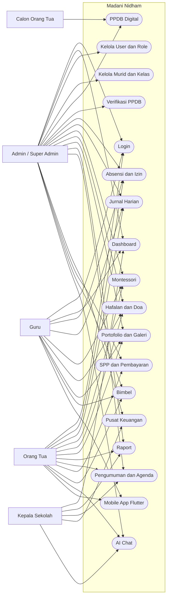

---

# 12. Alur Kerja Sistem

## 12.1 Alur Reservasi Pasien

Alur ini disesuaikan menjadi PPDB digital.

1. Calon orang tua membuka form PPDB publik.
2. Calon orang tua mengisi identitas anak dan orang tua.
3. Calon orang tua memilih program/level.
4. Calon orang tua mengunggah dokumen.
5. Sistem membuat nomor pendaftaran.
6. Admin melihat pendaftaran baru.
7. Admin meninjau dokumen dan data.
8. Admin mengubah status menjadi diterima, ditolak, atau waitlist.
9. Jika diterima, admin mengonversi data menjadi murid aktif.

## 12.2 Alur Pemeriksaan

Alur ini disesuaikan menjadi pencatatan perkembangan harian.

1. Guru memilih kelas.
2. Guru mengisi absensi.
3. Guru menulis jurnal anak.
4. Guru memperbarui Montessori.
5. Guru memperbarui hafalan/doa.
6. Guru mengunggah portofolio atau galeri.
7. Orang tua melihat hasilnya dari mobile app.

## 12.3 Alur Dashboard

1. User login.
2. Sistem membaca role dan permission.
3. Sistem menampilkan menu sesuai permission.
4. Dashboard mengambil data ringkasan dari API.
5. Chart, card, tabel, dan alert ditampilkan.
6. User melakukan drill down ke modul terkait.

## 12.4 Alur Laporan

1. User membuka modul laporan/rekap.
2. User memilih filter tanggal, bulan, kelas, status, atau murid.
3. Sistem menampilkan data tabel dan ringkasan angka.
4. User dapat melakukan search.
5. Untuk raport, sistem menghasilkan PDF.
6. Untuk keuangan, sistem menampilkan audit uang masuk dan keluar.

---

# 13. Diagram Aktivitas Reservasi Digital

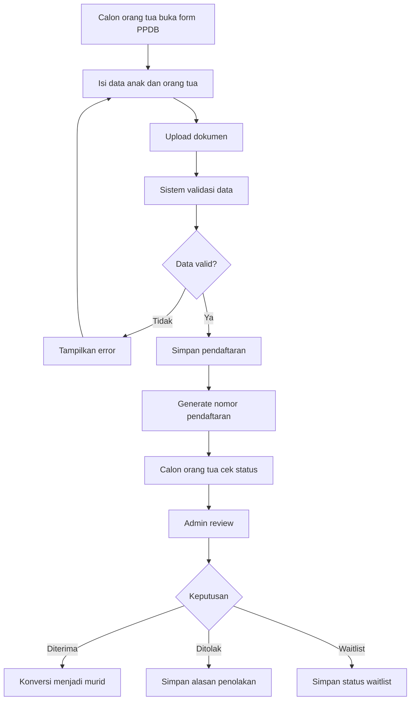

---

# 14. Diagram Aktivitas Pemeriksaan

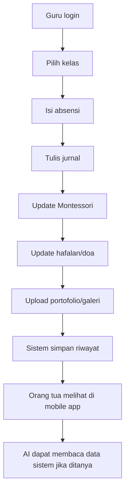

---

# 15. Kebutuhan Fungsional

## 15.1 Modul Registrasi

* Sistem harus menyediakan form PPDB publik.
* Sistem harus membuat nomor pendaftaran unik.
* Sistem harus menyimpan dokumen pendaftaran.
* Sistem harus menyediakan cek status pendaftaran.

## 15.2 Modul Login

* Sistem harus memvalidasi email dan password.
* Sistem harus menolak akun nonaktif.
* Sistem harus mengembalikan token API.
* Sistem harus menyediakan logout.
* Mobile app harus menyimpan token secara aman.

## 15.3 Modul Dashboard

* Sistem harus menampilkan dashboard sesuai role.
* Sistem harus menampilkan card ringkasan.
* Sistem harus menampilkan chart akademik dan keuangan.
* Sistem harus menampilkan action item.

## 15.4 Modul Akun

* Sistem harus dapat membuat user.
* Sistem harus dapat mengubah user.
* Sistem harus dapat menonaktifkan user.
* Sistem harus dapat mengatur role dan permission.
* Sistem harus dapat menghubungkan orang tua dengan anak.

## 15.5 Modul Dokter

Pada sistem ini, modul dokter menjadi modul guru.

* Sistem harus menyimpan user guru.
* Sistem harus menghubungkan guru ke kelas.
* Sistem harus membatasi akses guru sesuai permission.
* Mobile app guru harus bisa mengakses tugas harian.

## 15.6 Modul Jadwal Dokter

Pada sistem ini, modul jadwal dokter menjadi modul tahun ajaran, kelas, agenda, dan bimbel.

* Sistem harus menyimpan tahun ajaran.
* Sistem harus mengaktifkan satu tahun ajaran utama.
* Sistem harus menyimpan kelas dan kapasitas.
* Sistem harus menyimpan agenda.
* Sistem harus menyimpan jadwal sesi bimbel.

## 15.7 Modul Pasien

Pada sistem ini, modul pasien menjadi modul murid.

* Sistem harus menyimpan biodata murid.
* Sistem harus menyimpan foto murid.
* Sistem harus menyimpan relasi orang tua.
* Sistem harus menyimpan kelas aktif.
* Sistem harus menyediakan pencarian murid.

## 15.8 Modul Reservasi

Pada sistem ini, modul reservasi menjadi PPDB.

* Sistem harus menerima pendaftaran publik.
* Sistem harus memvalidasi data wajib.
* Sistem harus menyimpan status pendaftaran.
* Sistem harus mendukung review admin.
* Sistem harus mendukung konversi menjadi murid.

## 15.9 Modul Kunjungan

Pada sistem ini, modul kunjungan menjadi absensi dan izin/sakit.

* Sistem harus mencatat absensi per tanggal.
* Sistem harus mencegah duplikasi absensi murid pada tanggal yang sama.
* Sistem harus membatasi tanggal input maksimal hari ini.
* Sistem harus menerima izin/sakit dari orang tua.
* Sistem harus mendukung review izin/sakit.

## 15.10 Modul Pemeriksaan

Pada sistem ini, modul pemeriksaan menjadi jurnal perkembangan.

* Sistem harus mencatat jurnal per anak per tanggal.
* Sistem harus menyimpan mood dan aktivitas.
* Sistem harus menyimpan foto jurnal.
* Sistem harus mendukung edit dan hapus.
* Sistem harus menyediakan arsip dan pencarian.

## 15.11 Modul Penyakit

Pada sistem ini, modul penyakit menjadi Montessori.

* Sistem harus menyimpan area Montessori.
* Sistem harus menyimpan milestone.
* Sistem harus menyimpan progres murid.
* Sistem harus mendukung batch update.
* Sistem harus menyediakan arsip dan filter.

## 15.12 Modul Obat dan Resep

Pada sistem ini, modul obat dan resep menjadi hafalan, doa, portofolio, galeri, dan parenting.

* Sistem harus menyimpan master surah.
* Sistem harus menyimpan master doa.
* Sistem harus menyimpan progres murid.
* Sistem harus menyimpan portofolio karya anak.
* Sistem harus menyimpan galeri kelas.
* Sistem harus menyimpan artikel parenting.

## 15.13 Modul Medical Record

Pada sistem ini, medical record menjadi raport dan ringkasan perkembangan.

* Sistem harus membuat draft raport.
* Sistem harus mengubah catatan raport.
* Sistem harus publish raport.
* Sistem harus menghasilkan PDF.
* Sistem harus menyimpan status tanda tangan visual/PSrE-ready.

## 15.14 Modul Riwayat

* Sistem harus menyimpan riwayat perubahan data utama.
* Sistem harus menampilkan arsip jurnal, Montessori, hafalan, portofolio, dan galeri.
* Sistem harus menyimpan audit keuangan.
* Sistem harus menyimpan riwayat AI chat.

## 15.15 Modul Laporan

* Sistem harus menampilkan laporan dashboard.
* Sistem harus menampilkan laporan absensi.
* Sistem harus menampilkan laporan keuangan.
* Sistem harus menampilkan laporan PPDB.
* Sistem harus menampilkan usage AI.

---

# 16. Kebutuhan Non-Fungsional

* Website dashboard harus responsif untuk desktop dan tablet.
* Mobile app Flutter harus nyaman untuk orang tua dan guru.
* API harus menggunakan response JSON konsisten.
* Auth harus memakai token.
* Permission harus dicek di backend.
* Input tanggal akademik tidak boleh melewati hari ini untuk data harian tertentu.
* File upload harus tervalidasi.
* Chart dan dashboard harus tetap terbaca pada data kosong.
* Pusat Keuangan harus menghitung dari sumber data yang sama dengan audit.
* AI tidak boleh mengubah angka sistem.
* Sistem harus dapat dijalankan lokal dengan dokumentasi jelas.
* Build web harus lolos lint dan TypeScript.
* Test API harus lolos untuk workflow utama.

---

# 17. Aturan Bisnis

1. Satu murid hanya boleh punya satu absensi per tanggal.
2. Tanggal absensi, jurnal, Montessori, hafalan, portofolio, dan galeri maksimal hari ini.
3. Orang tua hanya melihat data anak yang terhubung dengan akun.
4. Guru hanya mengelola data sesuai permission.
5. Super admin memiliki semua akses.
6. PPDB accepted dapat dikonversi menjadi murid.
7. Tagihan SPP unik berdasarkan murid, fee type, bulan, dan tahun.
8. Pembayaran SPP dapat partial.
9. Kas manual masuk ke Pusat Keuangan dan audit.
10. Gaji guru masuk sebagai uang keluar jika status paid.
11. AI finance menjawab dari data sistem lokal, tidak dipoles provider eksternal.
12. Raport hanya terlihat orang tua jika sudah publish.
13. Pengumuman dapat ditargetkan ke semua, kelas, atau orang tua tertentu.
14. Galeri dapat dipublish/unpublish.
15. Artikel parenting harus dipublish agar terlihat.

---

# 18. Validasi Data

* Email wajib valid dan unik untuk user.
* Password wajib memenuhi minimal panjang yang ditentukan.
* Nama murid wajib diisi.
* Tanggal lahir wajib valid.
* Program PPDB wajib salah satu KB, TK A, TK B, TK C.
* Status absensi wajib hadir, izin, sakit, atau alfa.
* Tanggal input harian tidak boleh lebih dari hari ini.
* Nominal pembayaran dan kas wajib angka positif.
* Status tagihan wajib unpaid, partial, paid, atau waived.
* Status gaji wajib draft, approved, paid, atau cancelled.
* Upload dokumen/foto harus file yang diizinkan.
* Role hanya boleh dari role sistem.
* Tahun ajaran memiliki start date dan end date valid.
* AI harus menerima pertanyaan dan mengembalikan jawaban aman jika provider gagal.

---

# 19. Use Case Specification

## 19.1 Use Case — Registrasi Pasien

**Disesuaikan menjadi Registrasi PPDB.**

* Aktor: Calon orang tua.
* Trigger: Calon orang tua membuka form PPDB.
* Precondition: Website publik dapat mengakses API.
* Main flow:
  1. Calon orang tua mengisi data anak.
  2. Calon orang tua mengisi data orang tua.
  3. Calon orang tua upload dokumen.
  4. Sistem validasi.
  5. Sistem menyimpan pendaftaran.
  6. Sistem membuat nomor pendaftaran.
* Output: Nomor pendaftaran dan status pending.

## 19.2 Use Case — Buat Reservasi Digital

**Disesuaikan menjadi Ajukan PPDB Digital.**

* Aktor: Calon orang tua.
* Trigger: Submit form PPDB.
* Precondition: Data wajib lengkap.
* Main flow:
  1. Sistem menerima payload.
  2. Sistem upload dokumen.
  3. Sistem menyimpan data.
  4. Sistem mengembalikan nomor pendaftaran.
* Output: Pendaftaran tercatat.

## 19.3 Use Case — Verifikasi Reservasi

**Disesuaikan menjadi Verifikasi PPDB.**

* Aktor: Admin.
* Trigger: Admin membuka detail pendaftaran.
* Precondition: Pendaftaran tersedia.
* Main flow:
  1. Admin membaca data.
  2. Admin memeriksa dokumen.
  3. Admin memilih status.
  4. Admin mengisi catatan.
  5. Sistem menyimpan review.
* Output: Status PPDB berubah.

## 19.4 Use Case — Check-in Pasien

**Disesuaikan menjadi Konversi PPDB Menjadi Murid.**

* Aktor: Admin.
* Trigger: Pendaftaran diterima.
* Precondition: Tahun ajaran aktif tersedia.
* Main flow:
  1. Admin klik konversi.
  2. Sistem membuat data murid.
  3. Sistem membuat relasi orang tua.
  4. Sistem menghubungkan murid ke kelas/tahun ajaran.
  5. Sistem menyimpan converted student.
* Output: Murid aktif terbentuk.

## 19.5 Use Case — Isi Pemeriksaan

**Disesuaikan menjadi Tulis Jurnal dan Update Progres Anak.**

* Aktor: Guru/Admin.
* Trigger: Guru membuka kelas/murid.
* Precondition: Murid aktif tersedia.
* Main flow:
  1. Guru memilih murid.
  2. Guru mengisi jurnal.
  3. Guru memilih mood/aktivitas.
  4. Guru upload foto.
  5. Guru update Montessori/hafalan jika perlu.
  6. Sistem menyimpan data.
* Output: Orang tua dapat melihat perkembangan anak.

## 19.6 Use Case — Tambah Obat ke Pemeriksaan

**Disesuaikan menjadi Catat Pembayaran atau Kas.**

* Aktor: Admin.
* Trigger: Ada pembayaran atau transaksi kas.
* Precondition: User punya permission manage_fees.
* Main flow:
  1. Admin membuka SPP/Pusat Keuangan.
  2. Admin menginput pembayaran atau catatan kas.
  3. Sistem validasi nominal dan tanggal.
  4. Sistem menyimpan transaksi.
  5. Sistem memperbarui chart, audit, dan summary.
* Output: Pusat Keuangan terupdate.

## 19.7 Use Case — Lihat Dashboard

* Aktor: Semua role login.
* Trigger: User masuk ke dashboard.
* Precondition: Token valid.
* Main flow:
  1. Sistem membaca role.
  2. Sistem membaca permission.
  3. Sistem mengambil ringkasan API.
  4. Sistem menampilkan card, chart, dan list sesuai role.
* Output: Dashboard role-based tampil.

---

# 20. Desain Database

## 20.1 Daftar Tabel

Tabel utama:

1. `users`
2. `roles`
3. `permissions`
4. `academic_years`
5. `classes`
6. `students`
7. `student_parents`
8. `student_classes`
9. `attendances`
10. `absence_requests`
11. `journals`
12. `montessori_areas`
13. `montessori_milestones`
14. `student_milestones`
15. `hafalan_surahs`
16. `student_hafalan`
17. `doa_daily`
18. `student_doa`
19. `student_portfolios`
20. `class_galleries`
21. `reports`
22. `announcements`
23. `school_agendas`
24. `registrations`
25. `enrollment_updates`
26. `school_bank_accounts`
27. `fee_types`
28. `student_fees`
29. `fee_payments`
30. `finance_entries`
31. `teacher_payrolls`
32. `tutoring_sessions`
33. `tutoring_bookings`
34. `parenting_articles`
35. `ai_chat_histories`
36. `ai_manager_chat_histories`
37. `ai_chat_usages`
38. `notifications`
39. `settings`

## 20.2 Tabel `users`

Menyimpan akun login internal dan orang tua.

| Field | Keterangan |
| --- | --- |
| `id` | Primary key |
| `name` | Nama user |
| `email` | Email login |
| `password` | Hash password |
| `phone` | Nomor telepon |
| `is_active` | Status akun |
| `fcm_token` | Token notifikasi mobile |

## 20.3 Tabel `patients`

Pada sistem ini, tabel disesuaikan menjadi `students`.

| Field | Keterangan |
| --- | --- |
| `id` | Primary key |
| `nis` | Nomor induk siswa |
| `full_name` | Nama lengkap |
| `nickname` | Nama panggilan |
| `birth_date` | Tanggal lahir |
| `gender` | L/P |
| `photo_url` | Foto |
| `address` | Alamat |
| `blood_type` | Golongan darah |
| `allergy_notes` | Catatan alergi |
| `medical_notes` | Catatan kesehatan |
| `status` | active/inactive/alumni |

## 20.4 Tabel `doctors`

Pada sistem ini, guru/staff disimpan di `users` dengan role `guru`, `admin`, `kepala_sekolah`, atau `super_admin`.

| Field | Keterangan |
| --- | --- |
| `users.id` | Primary key |
| `users.name` | Nama guru/staff |
| `users.email` | Email |
| `roles.name` | Role |
| `classes.teacher_id` | Relasi guru wali kelas |

## 20.5 Tabel `doctor_schedules`

Pada sistem ini, jadwal disesuaikan menjadi `academic_years`, `classes`, `school_agendas`, dan `tutoring_sessions`.

| Tabel | Fungsi |
| --- | --- |
| `academic_years` | Tahun ajaran aktif |
| `classes` | Kelas dan wali kelas |
| `school_agendas` | Agenda sekolah |
| `tutoring_sessions` | Jadwal bimbel |

## 20.6 Tabel `reservations`

Pada sistem ini, reservasi disesuaikan menjadi `registrations`.

| Field | Keterangan |
| --- | --- |
| `registration_number` | Nomor PPDB |
| `child_name` | Nama calon murid |
| `program_applied` | Level pilihan |
| `parent_name` | Nama orang tua |
| `parent_phone` | Nomor kontak |
| `document_urls` | Dokumen upload |
| `status` | Status PPDB |
| `reviewer_notes` | Catatan reviewer |
| `converted_student_id` | Murid hasil konversi |

## 20.7 Tabel `visits`

Pada sistem ini, kunjungan disesuaikan menjadi `attendances` dan `absence_requests`.

| Tabel | Fungsi |
| --- | --- |
| `attendances` | Catatan hadir/izin/sakit/alfa |
| `absence_requests` | Pengajuan izin/sakit dari orang tua |

## 20.8 Tabel `diseases`

Pada sistem ini, penyakit disesuaikan menjadi `montessori_areas` dan `montessori_milestones`.

| Tabel | Fungsi |
| --- | --- |
| `montessori_areas` | Area Montessori |
| `montessori_milestones` | Master milestone |
| `student_milestones` | Progres murid |

## 20.9 Tabel `examinations`

Pada sistem ini, pemeriksaan disesuaikan menjadi `journals`.

| Field | Keterangan |
| --- | --- |
| `student_id` | Murid |
| `class_id` | Kelas |
| `teacher_id` | Guru |
| `date` | Tanggal jurnal |
| `content` | Catatan |
| `photo_urls` | Foto |
| `mood` | Mood |
| `activities` | Aktivitas |
| `is_published` | Status publish |

## 20.10 Tabel `medicines`

Pada sistem ini, obat disesuaikan menjadi master hafalan, doa, dan konten.

| Tabel | Fungsi |
| --- | --- |
| `hafalan_surahs` | Master surah |
| `doa_daily` | Master doa |
| `parenting_articles` | Artikel parenting |

## 20.11 Tabel `prescription_details`

Pada sistem ini, detail resep disesuaikan menjadi progres dan konten murid.

| Tabel | Fungsi |
| --- | --- |
| `student_hafalan` | Progres surah |
| `student_doa` | Progres doa |
| `student_portfolios` | Portofolio karya |
| `class_galleries` | Galeri kelas |

## 20.12 Tabel `medical_records`

Pada sistem ini, medical record disesuaikan menjadi `reports`, keuangan, AI, dan settings pendukung.

| Tabel | Fungsi |
| --- | --- |
| `reports` | Raport |
| `student_fees` | Tagihan SPP |
| `fee_payments` | Pembayaran SPP |
| `finance_entries` | Kas manual |
| `teacher_payrolls` | Gaji guru |
| `ai_chat_histories` | AI chat orang tua |
| `ai_manager_chat_histories` | AI chat manajerial |
| `settings` | Pengaturan sekolah |

---

# 21. ERD

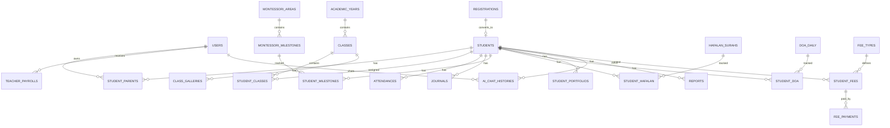

---

# 22. OOP Design

## 22.1 Encapsulation

Setiap model dan service menyembunyikan detail internal. Contoh:

* `FeeService` menangani kalkulasi dan sinkronisasi pembayaran.
* `GeminiService` menangani routing AI dan fallback provider.
* `AiDataAnswerService` mengunci jawaban berdasarkan data lokal.
* Flutter repository menyembunyikan detail HTTP dari UI screen.

## 22.2 Inheritance

### User Account

Konsep inheritance diterapkan secara konseptual melalui role:

* `SuperAdminAccount`
* `PrincipalAccount`
* `AdminAccount`
* `TeacherAccount`
* `ParentAccount`

Semua memakai tabel `users`, lalu perilaku akses dibedakan oleh role/permission.

### Person Profile

Profil manusia dipisahkan secara konseptual:

* `UserProfile` untuk staff/orang tua.
* `StudentProfile` untuk murid.
* `ParentProfile` melalui relasi `student_parents`.

## 22.3 Polymorphism

Polymorphism diterapkan pada:

* dashboard berbeda berdasarkan role,
* menu berbeda berdasarkan permission,
* AI chat berbeda antara room orang tua dan manajerial,
* Flutter screen berbeda berdasarkan role login.

## 22.4 Abstraction

Abstraction diterapkan pada:

* `apiFetch` di web,
* service Laravel untuk keuangan, AI, dan fee,
* Flutter API client dan repository,
* reusable UI seperti panel, card, chart, modal, badge, dan search.

## 22.5 Association

Relasi utama:

* user orang tua berasosiasi dengan banyak murid,
* murid berasosiasi dengan kelas,
* guru berasosiasi dengan kelas,
* murid berasosiasi dengan absensi, jurnal, hafalan, Montessori, raport, dan tagihan.

## 22.6 Composition

Composition diterapkan pada data yang bergantung penuh pada induknya:

* jurnal milik murid,
* progres hafalan milik murid,
* progres Montessori milik murid,
* detail pembayaran milik tagihan,
* chat AI milik user dan murid.

---

# 23. Daftar Class Utama

## 23.1 UserAccount

Representasi akun login.

Properti utama:

* `id`
* `name`
* `email`
* `role`
* `isActive`
* `permissions`

Method utama:

* `can(permission)`
* `isActive()`
* `children()`

## 23.2 AdminAccount

Representasi admin/super admin.

Method utama:

* `manageUsers()`
* `manageSchoolSettings()`
* `viewFinanceCenter()`
* `reviewRegistrations()`

## 23.3 DoctorAccount

Pada sistem ini, class disesuaikan menjadi `TeacherAccount`.

Method utama:

* `recordAttendance()`
* `writeJournal()`
* `updateMilestone()`
* `updateHafalan()`

## 23.4 PatientAccount

Pada sistem ini, class disesuaikan menjadi `ParentAccount`.

Method utama:

* `viewChildDashboard()`
* `submitAbsenceRequest()`
* `viewFees()`
* `chatWithAi()`

## 23.5 Person

Representasi data dasar manusia.

Properti:

* `fullName`
* `phone`
* `address`

## 23.6 DoctorProfile

Pada sistem ini, class disesuaikan menjadi `TeacherProfile`.

Properti:

* `userId`
* `assignedClass`
* `role`

## 23.7 PatientProfile

Pada sistem ini, class disesuaikan menjadi `StudentProfile`.

Properti:

* `studentId`
* `nis`
* `fullName`
* `birthDate`
* `gender`
* `activeClass`

## 23.8 DoctorSchedule

Pada sistem ini, class disesuaikan menjadi `AcademicSchedule`.

Properti:

* `academicYear`
* `class`
* `agenda`
* `tutoringSession`

## 23.9 Reservation

Pada sistem ini, class disesuaikan menjadi `Registration`.

Method:

* `submit()`
* `review()`
* `accept()`
* `reject()`
* `convertToStudent()`

## 23.10 Visit

Pada sistem ini, class disesuaikan menjadi `AttendanceRecord`.

Method:

* `markPresent()`
* `markSick()`
* `markPermit()`
* `markAbsent()`

## 23.11 Disease

Pada sistem ini, class disesuaikan menjadi `MontessoriMilestone`.

Method:

* `createMilestone()`
* `updateMilestone()`
* `assignToStudent()`
* `setProgressStatus()`

## 23.12 Examination

Pada sistem ini, class disesuaikan menjadi `LearningJournal`.

Method:

* `write()`
* `attachPhotos()`
* `publish()`
* `update()`

## 23.13 Medicine

Pada sistem ini, class disesuaikan menjadi `LearningResource`.

Contoh:

* `HafalanSurah`
* `DoaDaily`
* `ParentingArticle`

## 23.14 PrescriptionDetail

Pada sistem ini, class disesuaikan menjadi `LearningProgressDetail`.

Contoh:

* `StudentHafalan`
* `StudentDoa`
* `StudentMilestone`

## 23.15 MedicalRecord

Pada sistem ini, class disesuaikan menjadi `StudentReport`.

Method:

* `draft()`
* `updateNotes()`
* `generatePdf()`
* `publish()`

---

# 24. Diagram Class

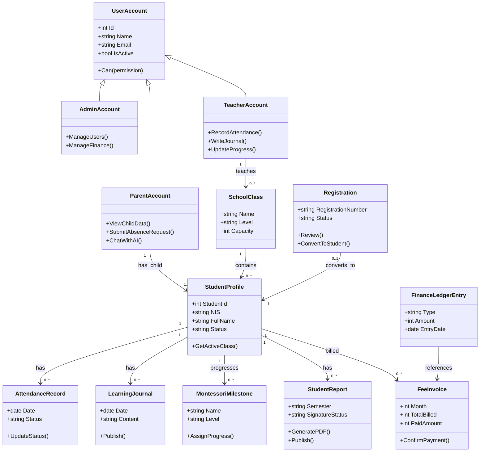

---

# 25. Diagram Sequence

## 25.1 Sequence — Reservasi Digital

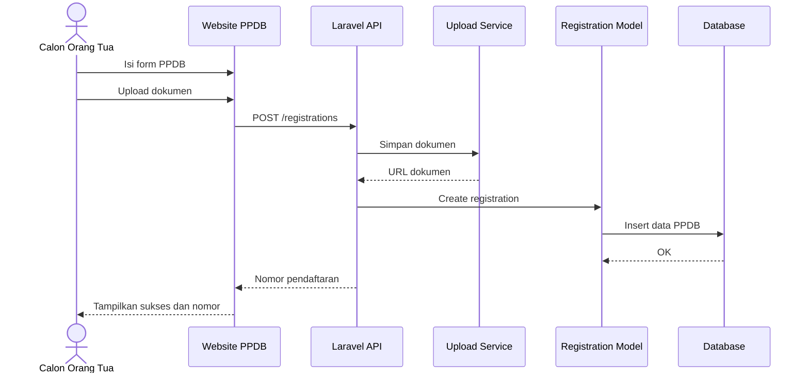

## 25.2 Sequence — Verifikasi dan Check-in

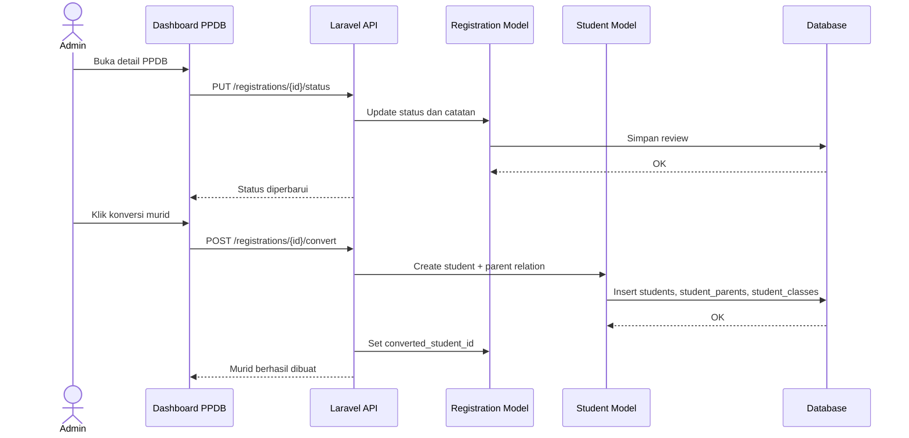

## 25.3 Sequence — Pemeriksaan, Penyakit, dan Resep

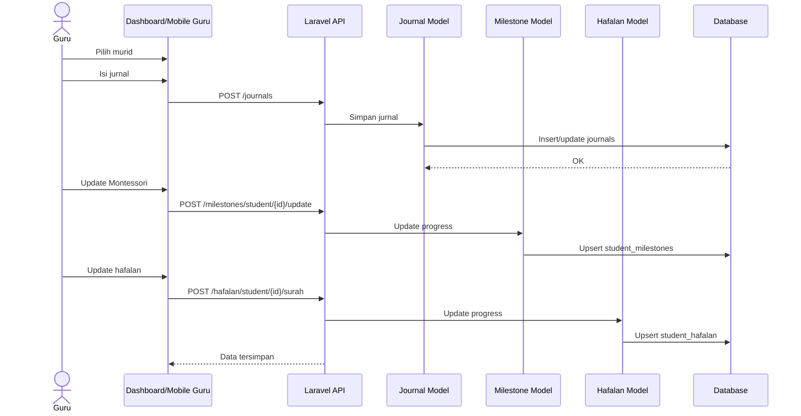

---

# 26. Diagram Status

## 26.1 Status Reservasi

Pada sistem ini, status reservasi disesuaikan menjadi status PPDB.

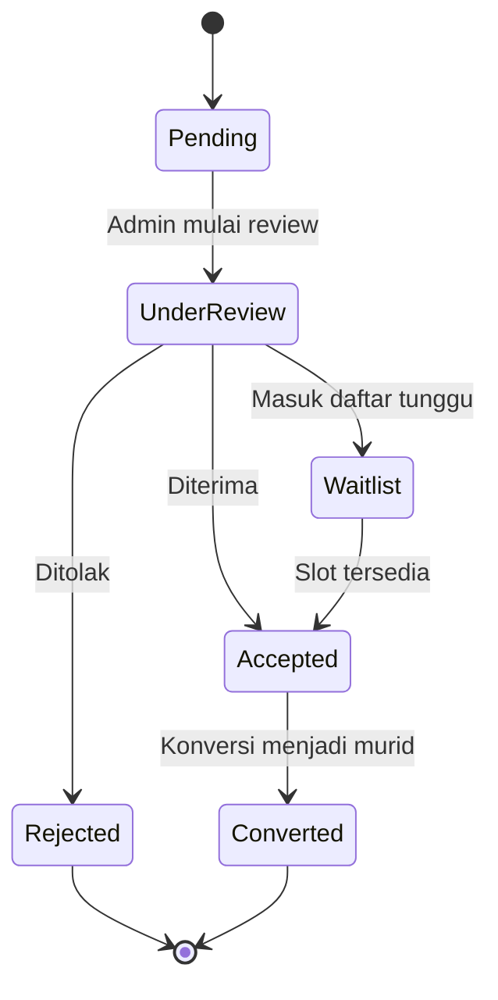

## 26.2 Status Kunjungan

Pada sistem ini, status kunjungan disesuaikan menjadi status tagihan dan izin.

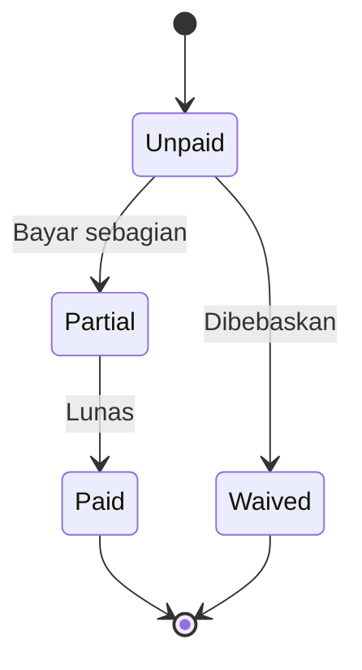

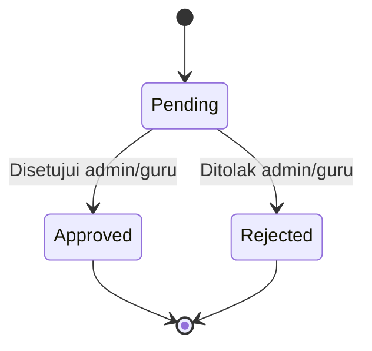

---

# 27. Struktur Arsitektur Proyek

```text
madani-nidham/
├── apps/
│   ├── api/
│   │   ├── app/
│   │   │   ├── Http/Controllers/Api/
│   │   │   ├── Models/
│   │   │   ├── Services/
│   │   │   └── Support/
│   │   ├── database/
│   │   │   ├── migrations/
│   │   │   └── seeders/
│   │   ├── routes/api.php
│   │   └── resources/views/pdf/report.blade.php
│   └── web/
│       ├── src/app/
│       ├── src/components/
│       ├── src/lib/
│       └── public/images/
├── mobile/
│   └── madani_nidham_flutter/
│       ├── lib/
│       │   ├── core/
│       │   ├── data/
│       │   ├── domain/
│       │   ├── features/
│       │   │   ├── auth/
│       │   │   ├── dashboard/
│       │   │   ├── children/
│       │   │   ├── attendance/
│       │   │   ├── journals/
│       │   │   ├── montessori/
│       │   │   ├── hafalan/
│       │   │   ├── reports/
│       │   │   ├── fees/
│       │   │   ├── announcements/
│       │   │   ├── tutoring/
│       │   │   └── ai_chat/
│       │   └── shared/
│       └── pubspec.yaml
├── docs/
└── README.md
```

---

# 28. Desain Tampilan UI

## 28.1 Konsep UI

Tampilan sistem menggunakan konsep:

* bersih,
* modern,
* profesional,
* ramah untuk sekolah Islam Montessori,
* mudah discan,
* tidak terlalu ramai,
* fokus pada data harian dan tindak lanjut.

## 28.2 Palet Warna

| Elemen | Warna |
| --- | --- |
| Primary | `#0A1F5C` |
| Secondary | `#123C8C` |
| Accent | `#F5C542` |
| Background | `#F8FAFC` |
| Card / Panel | `#FFFFFF` |
| Border | `#E2E8F0` |
| Text utama | `#0A1F5C` |
| Text sekunder | `#64748B` |
| Success | `#10B981` |
| Warning | `#F59E0B` |
| Danger | `#EF4444` |

## 28.3 Komponen UI yang Disarankan

* Sidebar menu.
* Bottom navigation mobile.
* Header halaman.
* Card angka/statistik.
* Badge status.
* Tabel data.
* Search box.
* Filter tanggal/bulan/status.
* Segmented tab.
* Modal form.
* Upload field.
* Chart arus kas dan akademik.
* Timeline anak untuk mobile.
* Empty state.
* Toast notification.

## 28.4 Warna Status

| Status | Warna Tampilan |
| --- | --- |
| Pending | Kuning |
| Under Review | Biru |
| Accepted / Approved | Hijau |
| Rejected | Merah |
| Waitlist | Ungu |
| Converted | Hijau tua |
| Hadir | Hijau |
| Izin | Kuning |
| Sakit | Biru |
| Alfa | Merah |
| Unpaid | Merah |
| Partial | Kuning |
| Paid | Hijau |
| Draft | Abu-abu |
| Published | Hijau |

---

# 29. Rekomendasi Layout Dashboard

## 29.1 Layout Dashboard Admin

```text
+----------------------------------------------------------------+
| Madani Nidham | Dashboard Admin                 [Nama Admin]   |
+------------------+---------------------------------------------+
| Sidebar          | Card: Murid Aktif | Card: Hadir Hari Ini    |
| - Dashboard      | Card: Jurnal      | Card: PPDB Pending     |
| - Murid          |---------------------------------------------|
| - Absensi        | Grafik Absensi Mingguan                     |
| - Jurnal         |---------------------------------------------|
| - PPDB           | Pusat Keuangan + Action Items               |
| - Pusat Keuangan |---------------------------------------------|
| - Pengaturan     | Agenda, Pengumuman, Tindak Lanjut           |
+------------------+---------------------------------------------+
```

## 29.2 Layout Dashboard Dokter

Pada sistem ini, layout disesuaikan menjadi dashboard guru.

```text
+----------------------------------------------------------------+
| Madani Nidham | Dashboard Guru                  [Nama Guru]    |
+------------------+---------------------------------------------+
| Sidebar          | Card: Murid Kelas                           |
| - Dashboard      | Card: Absensi Hari Ini                      |
| - Absensi        | Card: Jurnal Hari Ini                       |
| - Jurnal         |---------------------------------------------|
| - Montessori     | Tabel Murid Kelas                           |
| - Hafalan        | Nama | Absensi | Jurnal | Montessori | Aksi  |
| - Portofolio     |---------------------------------------------|
| - Galeri         | Agenda dan Permintaan Izin/Sakit            |
+------------------+---------------------------------------------+
```

## 29.3 Layout Dashboard Pasien

Pada sistem ini, layout disesuaikan menjadi mobile dashboard orang tua.

```text
+--------------------------------------------------+
| Madani Nidham Mobile                             |
+--------------------------------------------------+
| Child Switcher: [Nama Anak] [Kelas]              |
|--------------------------------------------------|
| Card Absensi Hari Ini                            |
| Card Jurnal Terakhir                             |
| Card Tagihan Aktif                               |
|--------------------------------------------------|
| Timeline Perkembangan                            |
| - Jurnal                                         |
| - Montessori                                     |
| - Hafalan                                        |
| - Portofolio                                     |
|--------------------------------------------------|
| Bottom Nav: Beranda | Anak | Tagihan | Info | AI |
+--------------------------------------------------+
```

---

# 30. Query Data Dashboard yang Disarankan

## 30.1 Dashboard Admin

* Murid aktif: count `students` where `status = active`.
* Hadir hari ini: count `attendances` where date today and status hadir.
* Tidak hadir: count `attendances` where status izin/sakit/alfa.
* Jurnal hari ini: count `journals` where date today.
* PPDB pending: count `registrations` where status pending/under_review.
* Pemasukan: sum SPP, uang pendaftaran, dan kas income.
* Pengeluaran: sum gaji paid dan kas expense.
* Saldo: pemasukan minus pengeluaran.

## 30.2 Dashboard Dokter

Pada sistem ini, query disesuaikan menjadi dashboard guru.

* Murid kelas: `student_classes` join `students`.
* Absensi kelas: `attendances` berdasarkan class_id dan tanggal.
* Jurnal hari ini: `journals` berdasarkan teacher_id/date.
* Montessori perlu update: `student_milestones` berdasarkan status.
* Hafalan: `student_hafalan` berdasarkan status.
* Izin/sakit: `absence_requests` berdasarkan tanggal/status.

## 30.3 Dashboard Pasien

Pada sistem ini, query disesuaikan menjadi dashboard orang tua.

* Profil anak: `student_parents` join `students`.
* Absensi anak: `attendances` berdasarkan student_id.
* Jurnal anak: `journals` published berdasarkan student_id.
* Montessori: `student_milestones` join `montessori_milestones`.
* Hafalan: `student_hafalan` join `hafalan_surahs`.
* Tagihan: `student_fees` berdasarkan student_id.
* Raport: `reports` published berdasarkan student_id.

---

# 31. Pembagian Tugas untuk 4 Orang

## Anggota 1 — Login, Session, Akun, Dashboard

Fokus:

* Auth API.
* Login web.
* Login Flutter.
* Role dan permission.
* Dashboard role-based.
* User dan role management.

Class/modul utama:

* `User`
* `Role`
* `Permission`
* `AuthService`
* `DashboardService`
* `AuthRepository` Flutter

## Anggota 2 — Dokter, Jadwal, Penyakit

Disesuaikan menjadi akademik inti.

Fokus:

* Murid.
* Kelas.
* Tahun ajaran.
* Agenda.
* Montessori area dan milestone.
* Mobile screen data anak.

Class/modul utama:

* `Student`
* `SchoolClass`
* `AcademicYear`
* `SchoolAgenda`
* `MontessoriArea`
* `MontessoriMilestone`

## Anggota 3 — Pasien, Reservasi, Check-in, Antrian

Disesuaikan menjadi PPDB, absensi, izin, dan jurnal.

Fokus:

* PPDB publik.
* Konversi PPDB.
* Absensi.
* Izin/sakit.
* Jurnal.
* Mobile parent daily timeline.

Class/modul utama:

* `Registration`
* `Attendance`
* `AbsenceRequest`
* `Journal`
* `StudentParent`

## Anggota 4 — Pemeriksaan, Obat, Riwayat, Laporan

Disesuaikan menjadi keuangan, raport, AI, dan laporan.

Fokus:

* SPP.
* Uang pendaftaran.
* Pusat Keuangan.
* Gaji guru.
* Raport PDF.
* AI chat.
* Audit dan laporan.

Class/modul utama:

* `StudentFee`
* `FeePayment`
* `FinanceEntry`
* `TeacherPayroll`
* `Report`
* `AiChatHistory`
* `GeminiService`

---

# 32. Skenario Demo Presentasi

## Skenario 1 — Pasien

Disesuaikan menjadi orang tua.

1. Orang tua login mobile app.
2. Orang tua memilih anak.
3. Orang tua melihat absensi hari ini.
4. Orang tua membaca jurnal terbaru.
5. Orang tua melihat progres Montessori/hafalan.
6. Orang tua melihat tagihan.
7. Orang tua bertanya ke AI tentang perkembangan anak.

## Skenario 2 — Admin

1. Admin login website.
2. Admin melihat dashboard.
3. Admin membuka PPDB.
4. Admin menerima pendaftaran.
5. Admin mengonversi pendaftar menjadi murid.
6. Admin generate SPP.
7. Admin melihat Pusat Keuangan dan audit.

## Skenario 3 — Dokter

Disesuaikan menjadi guru.

1. Guru login.
2. Guru membuka kelas.
3. Guru mengisi absensi.
4. Guru menulis jurnal.
5. Guru update Montessori.
6. Guru update hafalan.
7. Guru upload portofolio/galeri.

## Skenario 4 — Hasil Akhir

1. Kepala sekolah login.
2. Kepala sekolah melihat dashboard dan analitik.
3. Orang tua membuka mobile app.
4. Orang tua melihat data anak sudah update.
5. Admin membuka audit keuangan.
6. AI menjawab pertanyaan finance atau perkembangan anak dari data sistem.

---

# 33. Risiko dan Solusi

## 33.1 Risiko

* Modul banyak dan saling bergantung.
* Mobile app bisa tertinggal dari fitur web.
* Role access keliru.
* Data orang tua bisa melihat anak yang salah jika relasi tidak ketat.
* Input tanggal masa depan bisa merusak data harian.
* Data keuangan bisa berbeda antara chart, audit, dan AI.
* AI bisa halusinasi jika jawaban dipoles provider.
* Upload file bisa gagal di environment lokal/produksi.
* Dashboard terlalu padat.
* Build dev dan production Next bisa bentrok jika cache `.next` tidak dibersihkan.

## 33.2 Solusi

* Kunci database dan permission sejak awal.
* API menjadi single source of truth untuk web dan Flutter.
* Buat repository Flutter per domain.
* Semua endpoint harus cek permission backend.
* Orang tua selalu difilter lewat `student_parents`.
* Validasi tanggal maksimal hari ini pada data harian.
* Pusat Keuangan, audit, dan AI memakai ledger yang sama.
* AI finance tidak dipoles provider eksternal.
* Buat fallback upload lokal dan provider cloud env-gated.
* Dashboard dipisah menjadi card, chart, dan subpage arsip.
* Gunakan runbook lokal untuk restart server dan bersihkan `.next`.

---

# 34. Rekomendasi Implementasi Bertahap

Urutan implementasi yang disarankan:

1. Stabilkan API auth dan role.
2. Stabilkan struktur murid, kelas, orang tua, dan tahun ajaran.
3. Stabilkan dashboard web.
4. Stabilkan absensi dan izin/sakit.
5. Stabilkan jurnal.
6. Stabilkan Montessori.
7. Stabilkan hafalan dan doa.
8. Stabilkan portofolio dan galeri.
9. Stabilkan PPDB dan konversi murid.
10. Stabilkan SPP dan pembayaran.
11. Stabilkan Pusat Keuangan, audit, dan gaji guru.
12. Stabilkan raport PDF.
13. Stabilkan pengumuman, agenda, artikel parenting.
14. Stabilkan AI chat berbasis data lokal.
15. Buat Flutter foundation: auth, routing, theme, API client.
16. Buat Flutter parent dashboard.
17. Buat Flutter child profile, absensi, jurnal, Montessori, hafalan.
18. Buat Flutter fees, announcements, agenda, gallery, report.
19. Buat Flutter AI chat.
20. Buat Flutter teacher mode untuk absensi/jurnal/progres.
21. Tambah push notification.
22. Tambah polishing UI dan QA responsive.
23. Tambah test API dan smoke test web/mobile.
24. Deploy API, dashboard, website publik, dan app build.

---

# 35. Kesimpulan

Madani Nidham versi PRD ini sudah menyesuaikan fitur yang ada di codebase sekarang dan rencana mobile app Flutter karena:

* memiliki role jelas: Super Admin, Kepala Sekolah, Admin, Guru, dan Orang Tua,
* mendukung website dashboard untuk operasional internal,
* mendukung mobile app Flutter untuk orang tua dan guru,
* memiliki PPDB digital dari pendaftaran sampai konversi murid,
* memiliki modul akademik harian: absensi, jurnal, Montessori, hafalan, doa, portofolio, dan galeri,
* memiliki raport PDF dan status publish,
* memiliki komunikasi sekolah: pengumuman, agenda, artikel parenting, dan notifikasi,
* memiliki Pusat Keuangan yang menyatukan SPP, uang pendaftaran, kas manual, audit, dan gaji guru,
* memiliki AI chat yang membaca data sistem dan dikunci agar tidak mengarang angka penting,
* memiliki database relasional yang cukup lengkap untuk operasional sekolah,
* tetap realistis dikembangkan bertahap karena API Laravel menjadi pusat data untuk website dan mobile app.

Nilai tambah terbesar pada sistem ini adalah penyatuan data akademik, komunikasi, keuangan, dan AI dalam satu sumber data:

* Admin melihat kondisi operasional sekolah.
* Kepala sekolah melihat progres dan laporan.
* Guru mengisi data perkembangan anak.
* Orang tua melihat informasi anak secara real-time dari mobile app.
* AI membantu membaca data tanpa menggantikan validasi sistem.

Dengan alur ini, Madani Nidham dapat didemokan secara end-to-end dan terlihat seperti sistem sekolah yang benar-benar siap dikembangkan untuk penggunaan harian.
